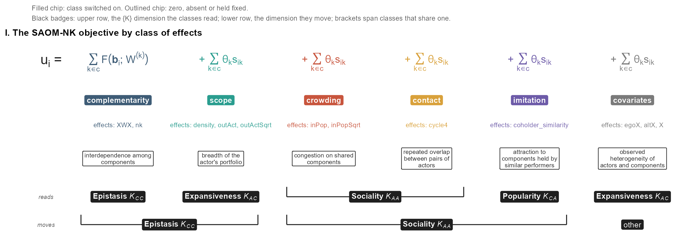
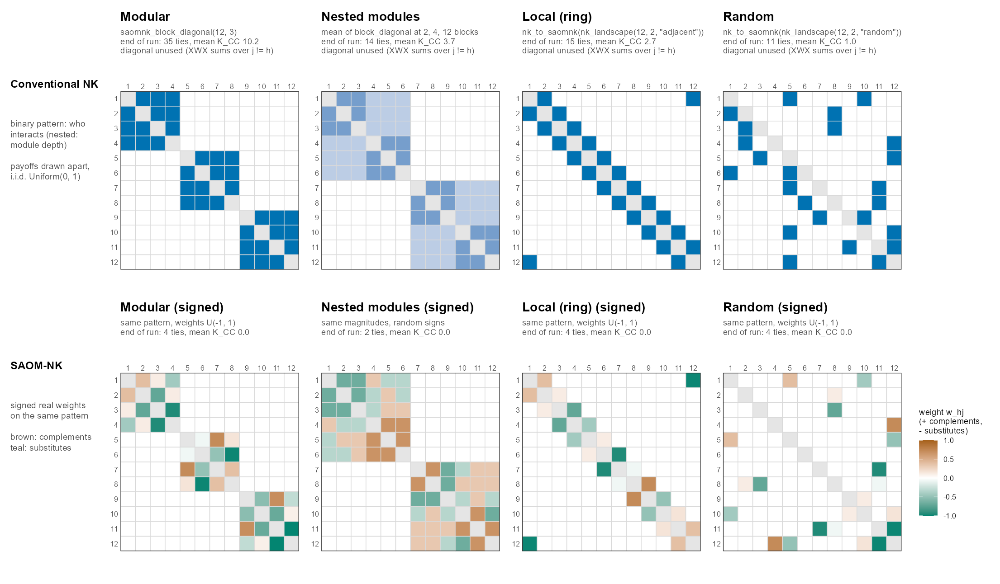
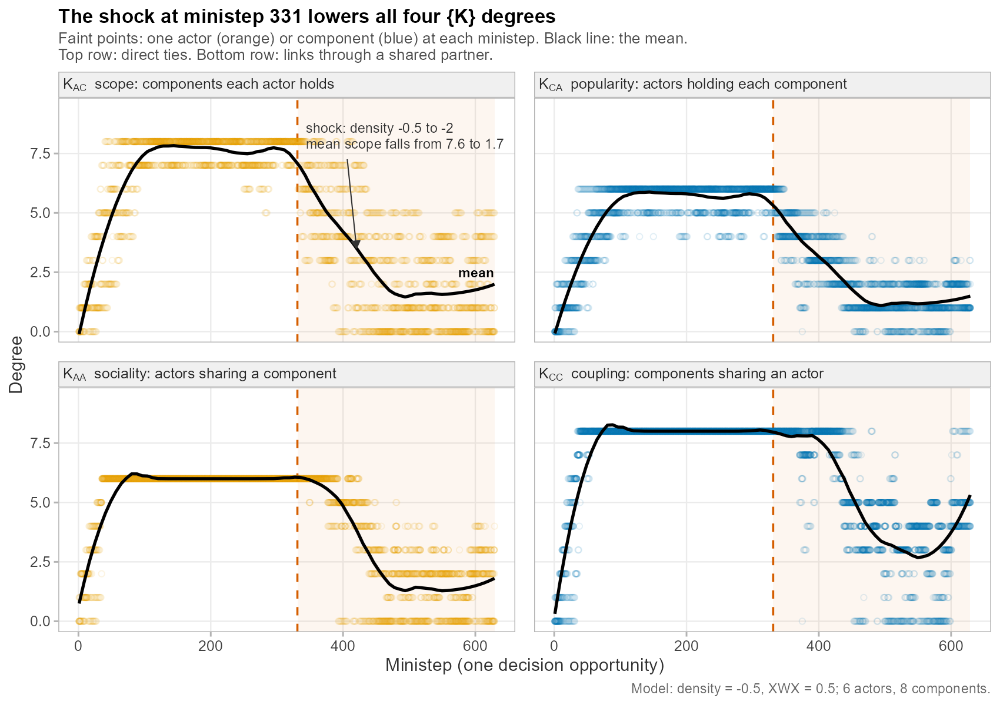
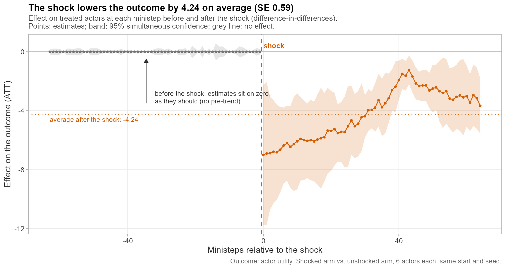
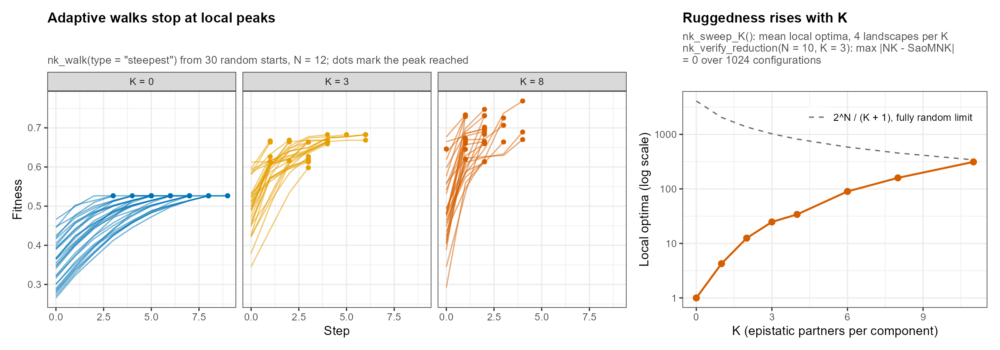

# searchnet

<!-- badges: start -->
[](https://lifecycle.r-lib.org/articles/stages.html#experimental)
[](https://github.com/sdownin/searchnet/actions/workflows/R-CMD-check.yaml)
[](https://choosealicense.com/licenses/mit/)
<!-- badges: end -->

**Network-Embedded Search Simulation Engine**

One simulated SAOM-NK run, animated: actor 4's fitness landscape recolors as the other actors move.


*A simulated run: 6 actors, 8 components, `W = saomnk_block_diagonal(8, 2)`;
density −2.5, popularity 0.2, influence weight 0.8; environment seed 42, run
seed 12345. Left: the bipartite network, one ministep at a time. Right: actor
4's landscape, its objective for each of the 256 portfolios it could hold given
the other actors' current ties (rows: which of components A–D it holds;
columns: which of E–H; each ordered by how many). Under this W the local peaks
sit at the corners (no components, one full module, or both), and their heights
change as the other actors move. Regenerate with
[`tools/make_readme_gif.R`](tools/make_readme_gif.R), which runs the
simulation, renders
[`inst/manim/scene_readme_landscape.py`](inst/manim/scene_readme_landscape.py)
with manim, and converts the video to a GIF with ffmpeg.*

The next animation adds what the first leaves implicit, for a larger run: the input W, the network as it evolves, and the {K}-4 degree series that track it.


*One seeded run with 8 actors and 12 components. Left: the influence matrix W supplied as input (three modules of four components), and the bipartite network ministep by ministep on fixed node positions (actors as circles, colored by strategy; components as squares, colored by module; ties formed during the run dark, ties dropped fading out). Right: the four coupled degree series `saomnk_plot_k4()` draws, revealed as the run advances; the last frame is the full run. Generated by [`tools/make_readme_hero_gif.R`](tools/make_readme_hero_gif.R) (environment seed 42, run seed 12345); a static version is [`man/figures/readme-hero.png`](man/figures/readme-hero.png), from [`tools/make_readme_figures.R`](tools/make_readme_figures.R).*

All six actors move at once. The same run with every actor on one shared landscape:


*All six actors on one shared landscape (same run as above: 6 actors, 8 components, environment seed 42, run seed 12345). The grid is the objective a new actor with the same parameters would get from each portfolio given all six actors' current ties. Each actor's own landscape differs from it only through that actor's own holdings (here by at most 1.6 on a range of about 12, and by 0.2 per held component at the actor's own cell); the trajectories on the left are each actor's own objective. Rendered by [`tools/make_all_actors_gif.R`](tools/make_all_actors_gif.R) `--shared=entrant` from [`inst/manim/scene_all_actors_landscape.py`](inst/manim/scene_all_actors_landscape.py).*

> [!WARNING]
> **Development status: experimental pre-release (v0.15.x).**
> This is a research release of a new package: the API is still
> evolving, breaking changes may occur between 0.x versions, and bugs are
> to be expected. The companion methods paper has not yet been
> peer-reviewed; results should be treated accordingly.
> For reproducibility, install a pinned tag rather than the moving branch:
> `devtools::install_github("sdownin/searchnet@v0.15.0")`.
> **v0.8.3 and earlier:** `saomnk_model()` simulations that declared
> `influence_weight`, `cycle4`, `XWX`, `X`, `inPopX`, `outActX` or
> `homXOutAct` did not simulate the declared coefficient (estimation via
> `siena07()` was unaffected); fixed in v0.9.0. Do not pin v0.8.3 or
> earlier for new work — full detail in
> [NEWS.md](NEWS.md#searchnet-090).
> **v0.10.0 and earlier:** `search_rsiena()`, and so `saomnk_run()` and
> every wrapper built on it, replayed independent one-ministep draws from
> the starting state as if they were a path. Simulated trajectories and end
> states from those versions are not draws from the declared model; re-run
> them on v0.11.0 or later, which simulates state-carrying paths. Full
> detail in [NEWS.md](NEWS.md).
> A stable API will be declared at v1.0.0. Bug reports with reproducible
> examples are very welcome via
> [GitHub Issues](https://github.com/sdownin/searchnet/issues).

## Overview

**searchnet** (formerly SaoMNK) is an R package that endogenizes the NK fitness landscape by reformulating it as a bipartite network data generation process. It bridges two research traditions that have developed independently: NK fitness landscape models from evolutionary theory and computational organization theory (Kauffman & Levin, 1987; Levinthal, 1997) and Stochastic Actor-Oriented Models (SAOMs) from social network analysis (Snijders, 1996; Ripley et al., 2022).

The package represents a search environment as a bipartite network of *M* actors affiliating with *N* components, where the fitness landscape topology is determined by the network structure and evolves endogenously through actors' search decisions. Because the model is formalized as a SAOM, it inherits the statistical infrastructure of RSiena, including maximum likelihood estimation, goodness-of-fit testing, and the capacity for empirical estimation on network panel data.

The central theoretical contribution is the **{K} framework**: the classical scalar complexity parameter *K* counts how many components affect each component (the degree of W); in the bipartite representation interdependence appears in four coupled degree dimensions, each carrying distinct strategic implications for search, adaptation, and competitive dynamics.

## Installation

```r
# Install from GitHub
install.packages("remotes")
remotes::install_github("sdownin/searchnet")

# Check the installation (versions, dependencies, a seeded smoke run)
searchnet::searchnet_check_setup()

# Or source directly for development
.saomnk_dir <- "path/to/searchnet/R"
source(file.path(dirname(.saomnk_dir), "inst", "saomnk-loader.R"))
```

### Requirements

- R >= 4.1.0
- Key dependencies: R6, RSiena, igraph, ggplot2, dplyr, Matrix, network

## Quick Start

The clean API provides user-friendly wrappers that handle RSiena internals automatically:

```r
library(searchnet)

# 1. Create a search environment: 6 actors, 8 components
env <- saomnk_env(M = 6, N = 8, density = 0.3, seed = 42)

# 2. Define a structure model with an influence matrix
model <- saomnk_model(
  density = -0.5,
  popularity = 0.2,
  influence_matrix = saomnk_block_diagonal(8, 2),
  influence_weight = 0.3
)

# 3. Run simulation
saomnk_run(env, model, steps_per_actor = 30, seed = 12345)

# 4. Visualize the coupled degree dynamics
saomnk_plot_k4(env)

# 5. Inspect results
saomnk_summary(env)
```

Step 4 draws the {K}-4 panel shown on the right of the second animation at the top.

### Adding Actor Strategies

Introduce heterogeneous search strategies via actor-level covariates:

```r
model <- saomnk_model(
  density = -0.3,
  popularity = 0.2,
  scope = 0.1,
  influence_matrix = saomnk_block_diagonal(12, 4),
  strategies = list(
    egoX   = c(-1, 0, 1, -1, 0, 1),
    inPopX = c( 1, 0, -1, 1, 0, -1)
  )
)
```

### Advanced / Direct API

Power users can work directly with the R6 simulation engine:

```r
# Create environment via R6 constructor
env <- SaomNkRSienaBiEnv$new(list(
  M = 6, N = 8, BI_PROB = 0.3,
  rand_seed = 42, name = "_demo_"
))

# Run search with a manually constructed structure model
env$search_rsiena(structure_model, iterations_per_actor = 30, run_seed = 12345)

# K-4 degree panel plot
env$plot_degree_4panel()

# Access bipartite matrix at each step
env$bipartite_matrices
```

## The {K} Framework

NK's scalar *K* is the degree of the influence matrix W (how many components affect each component). In the bipartite representation, interdependence appears in four coupled degree measures:

| Degree | Symbol | Projection | Interpretation |
|--------|--------|------------|----------------|
| Expansiveness | K_AC | Actor -> Component | How many components each actor holds; breadth of activity system |
| Popularity | K_CA | Component -> Actor | How many actors hold each component, and who they are |
| Sociality | K_AA | Actor -> Actor | How many other actors share a component with the actor (distinct partners) |
| Epistasis | K_CC | Component -> Component | How many other components are co-held with the component (distinct partners) |

These four dimensions are structurally coupled: changes in any one propagate through the bipartite structure to the others. The {K} framework provides a lens for analyzing how search, adaptation, and rivalry co-evolve.

#### Decision and outcome: the two {K} dimensions of each effect

The four {K} dimensions, and how an effect relates to them, are defined once in
[`inst/rosetta/K_DIMENSIONS.md`](inst/rosetta/K_DIMENSIONS.md). K_AA and K_CC
are distinct-partner counts; their weighted forms, **Sociality strength**
(components shared with other actors) and **Epistasis strength** (actors holding
both components), are what the coupling identities speak to: the second moment
of Popularity is total Sociality strength, and the second moment of
Expansiveness is total Epistasis strength.

Every effect has two {K} dimensions, contrasting its role in the actor's
utility with its role in the resulting network structure. The **decision
dimension** is the one its *change statistic* (the change in
actor *i*'s statistic when it toggles component *j*, i.e. its utility change
for the move) depends on,
derived by a perturbation test in this order: who the other holders are
(Popularity), else other actors' holdings (Sociality), else W (Epistasis), else
the actor's own portfolio or attributes (Expansiveness). A count of other
holders is read as the overlap a move creates (Sociality). The **outcome
dimension** is the network-structure dimension of its *target
statistic* (summed over actors): the moment estimation matches and the
coefficient moves first.

| Effect | Decision dimension | Outcome dimension (target statistic) |
|--------|--------------------|--------------------------------------|
| `density` | Expansiveness | total ties |
| `outAct` | Expansiveness | Epistasis strength |
| `inPop` | Sociality | Sociality strength |
| `XWX` | Epistasis | Epistasis strength valued by W |
| `cycle4` | Sociality | Sociality and Epistasis (four-cycle count) |
| `egoX` | Expansiveness | Expansiveness, attribute-weighted |
| `altX` | Expansiveness | Popularity, attribute-weighted |
| `simEgoInDist2` | Popularity | Sociality strength, similarity-weighted |

`searchnet_effect_dimensions()` returns the full table with formulas (also
shipped as `inst/rosetta/effect_dimensions.csv`), and
`searchnet_classify_effect()` classifies your own statistic by the same rules.
The outcome is the moment moved first, not the full equilibrium response, and the
sign of the coefficient changes the reading (crowding or agglomeration for
`inPop`), never the dimension.

### The objective by class of effects

Each actor's objective is a sum of class-grouped terms, one color per effect
class of `inst/rosetta/classes.yaml` (colors are the registry's tokens):

```math
\begin{aligned}
f_i(\mathbf{B}) ={}&
\underbrace{\color{#3E5C76}{\sum_{\ell}\theta^{(\ell)}_{\text{epist}}\sum_{j} b_{ij}\sum_{h\neq j} b_{ih}\,w^{(\ell)}_{hj}}}_{\substack{\color{#3E5C76}{\textbf{complementarity}}\ (K_{CC})\\ \text{Epistasis among held components}}}
\;+\;
\underbrace{\color{#2A9D8F}{\theta_{\text{dens}}\,b_{i+}+\theta_{\text{scope}}\,b_{i+}^{2}}}_{\substack{\color{#2A9D8F}{\textbf{scope}}\ (\text{decision}\ K_{AC}\mid\text{outcome}\ K_{CC})\\ \text{breadth of holdings}}}
\\
&+\;
\underbrace{\color{#C8553D}{\theta_{\text{pop}}\sum_{j} b_{ij}\,b_{+j}}}_{\substack{\color{#C8553D}{\textbf{popularity / crowding}}\ (K_{AA})\\ \text{crowding or agglomeration on shared components}}}
\;+\;
\underbrace{\color{#D9A13B}{\theta_{\text{close}}\,\frac{1}{2}\sum_{h\neq i}\binom{o_{ih}}{2}}}_{\substack{\color{#D9A13B}{\textbf{contact}}\ (\text{decision}\ K_{AA}\mid\text{outcome}\ K_{AA},K_{CC})\\ \text{repeated overlap between pairs of actors}}}
\\
&+\;
\underbrace{\color{#6D5BA8}{\theta_{\text{imit}}\sum_{j} b_{ij}\,\left(\mathrm{sim}_{ij}-\overline{\mathrm{sim}}\right)}}_{\substack{\color{#6D5BA8}{\textbf{imitation}}\ (\text{decision}\ K_{CA}\mid\text{outcome}\ K_{AA})\\ \text{imitation of components held by similar actors}}}
\;+\;
\underbrace{\color{#7A7A7A}{\theta_{\text{strat}}\,b_{i+}\tilde{v}_i+\theta_{\text{value}}\sum_{j} b_{ij}\,\tilde{c}_j}}_{\substack{\color{#7A7A7A}{\textbf{covariates}}\ (\text{decision}\ K_{AC}\mid\text{outcome by effect})\\ \text{observed heterogeneity of actors and components}}}
\end{aligned}
```

Here `b_i+` is actor *i*'s degree, `b_+j` component *j*'s degree (counting *i*),
`o_ih` the number of components actors *i* and *h* share, `W^(l)` the *l*-th
influence matrix, and `v`, `c` actor and component covariates centered on their
means. Each term is the RSiena 1.5.0 two-mode statistic the engine computes
(`density`, `outAct`, `inPop`, `cycle4`, `XWX`, `egoX`, `altX`). Imitation
enters a simulation through RSiena's covariate similarity effect
`simEgoInDist2` with an actor covariate; the co-holder performance similarity
of `saomnk_coholder_similarity()` is a post hoc statistic and is not simulated.



*The same classes as drawn by `rosetta_plot(NULL, compare = NULL, glyph = FALSE,
view = "both")` (row I alone), for viewers where the math above does not
render. Its two badge rows follow `inst/rosetta/classes.yaml`: the decision
{K} dimension of each class (utility) above, its outcome dimension (network)
below.
Generated by `tools/make_readme_figures.R`.*

### Terminology: W, K_CC, and epistatic fitness

The inter-component {K} dimension is called **epistasis** throughout the package and
the paper. It has *three* distinct elements, and collapsing any two of them is
a common source of confusion:

| | What it is | In searchnet |
|---|---|---|
| **Influence matrix (W)** | The **input**. An N x N matrix stating *which* components interact and *with what sign*. Rivkin & Siggelkow (2007) call this the influence matrix; it is also called the interaction matrix. Set by the analyst and fixed across the run (unless shocked). | `influence_matrix` argument to `saomnk_model()`; `saomnk_block_diagonal()` builds modular ones |
| **Component epistasis degree (K_CC)** | The **realized structure**. How many other components each component is currently co-adopted with: `colSums((B'B) > 0)`, a degree of the bipartite projection. W does not appear in this formula -- but W drives the search that produces `B`, so K_CC *evolves as a consequence of W*. | `saomnk_get_degrees()$K_CC`; the *Component Epistasis* row of the {K} table above |
| **Epistatic fitness** | The **outcome**. The performance consequence of holding interdependent components, accruing to actors and evolving over the run as W acts through search. | The `XWX` effect weighted by `influence_weight`, and the `synergy` term `b_i' W b_i / N^2` in `env$compute_formal_utility()` |

**You specify W; K_CC and epistatic fitness both evolve.** They co-evolve
rather than one feeding the other: W enters the objective function directly,
while K_CC is the structural state the same search produces. Neither is a
measurement of the other, and neither is a measurement of W.

That W really does drive K_CC is demonstrable rather than assumed. The figure
below varies only W, holding seeds and every other parameter fixed; and zeroing
the matrix gives a run bit-identical to zeroing `influence_weight`, confirming
the channel is the coefficient x matrix product. Note that in **v0.8.3 and earlier this channel was inert** -- the
declared `XWX` coefficient was not simulated (fixed in v0.9.0), so W could not
influence K_CC at all in those versions.



*Four influence-matrix architectures for 12 components, each built from package
functions (subtitles), run under the same model and seeds (environment seed 42,
run seed 12345; density -1.5, influence weight 0.5). Top row: the interaction
pattern as conventional NK uses it, nonnegative weights saying which components
interact, with payoffs drawn separately and i.i.d. Uniform(0, 1). Bottom row:
the same pattern with signed real weights (Uniform(-1, 1); nested modules keep
their magnitudes with random signs), which SAOM-NK takes directly: positive
weights are complements, negative weights substitutes. Subtitles report the ties
and mean realized K_CC at the end of each run; with substitutes offsetting
complements, little co-holding survives the density cost. Generated by
`tools/make_readme_figures.R`.*

Before v0.4.0 the API called the input `epistasis_matrix`, which blurred W
into the outcome. The old argument names still work but are deprecated.

## Features

### Simulation Engine
- `saomnk_run()` / `search_rsiena()` -- Run SAOM-based search simulation with configurable structure models
- `search_rsiena_multiwave_run()` -- Monte Carlo multi-wave execution for repeated experiments
- `saomnk_shock()` / `theta_shocks` -- Parametric shock schedules for quasi-experimental designs
- Reproducible simulations via random seed control



*A two-segment shock schedule (`saomnk_shock()`): density -0.5 for the first
half of model time, -2.0 for the second, on 6 actors and 8 components with a
two-module W. All four degree series turn down after the first shocked
ministep (331).
Generated by `tools/make_readme_figures.R` (environment seed 42, run seed
12345).*

### Structure Model Specification
- **Structural effects**: density, crowding (`inPop`; the `popularity` argument), scope (`outAct`)
- **Actor covariates** (`coCovars`): Strategy heterogeneity via `egoX`, `inPopX`; component covariates via `altX`, `outActX`
- **Dyadic covariates** (`coDyadCovars`): Exogenous influence matrices via `XWX`, actor-component payoffs via `X`
- **Time-varying covariates**: Dynamic strategy programs
- **Effect interactions**: Strategy-epistasis interaction terms
- `saomnk_block_diagonal()` -- Convenient modular influence matrix construction

### Visualization (61 exported plot functions)
- **K-4 degree panel**: Four coupled degree trajectories (`saomnk_plot_k4`, `saomnk_plot_degree_4panel`)
- **Network snapshots**: Bipartite, social, and component-coupling projections (`saomnk_plot_snapshots`)
- **Utility decomposition**: Per-actor, per-strategy, contribution breakdown (`saomnk_plot_actor_utility`, `saomnk_plot_utility_contributions`)
- **Exploration/exploitation analysis**: Share trajectories, phase space, and strategy views in one function (`searchnet_plot_exploration(type = ...)`); DID designs, event studies
- **Market dynamics**: Entry/survival visualization, Monte Carlo entry curves (`searchnet_plot_cumulative_entry`), bipartite ring markets
- **Shock analysis**: K-attribute shocks, pre/post comparison, degrees to new components (`searchnet_plot_new_component_shocks`)
- **Multi-wave summaries**: Ridge density plots, strategy-level K summaries (`searchnet_plot_multiwave(what = ..., by = ...)`)
- **Naming**: new functions use the `searchnet_` prefix and `saomnk_` names are frozen; superseded plot names still work, with a once-per-session deprecation warning (`?searchnet-naming`)

### Classic NK Landscapes
Conventional Kauffman NK models, self-contained and independent of RSiena — usable on their own, and as an external reference for the SAOM-NK reduction:
- `nk_landscape(N, K, model)` — exhaustive landscape over all 2^N configurations; `"adjacent"` (ring), `"random"`, or `"block"` (near-decomposable) epistasis
- `nk_walk()` — adaptive walks: `"steepest"`, `"greedy"`, `"random"`
- `nk_local_optima()` — exhaustive peak enumeration (about 2^N/(N+1) peaks in the fully random case K = N − 1)
- `nk_sweep_K()` — canonical ruggedness sweep across K
- `nk_to_saomnk()` / `nk_verify_reduction()` — bridge to the SAOM engine; the constructive form of Property 1 (NK is the M = 1, beta -> infinity case of SAOM-NK)

```r
nk <- nk_landscape(N = 10, K = 3, seed = 42)
nrow(nk_local_optima(nk))          # ruggedness rises with K
nk_walk(nk, start = 0)             # classic adaptive walk
nk_verify_reduction(N = 10, K = 3) # independent check of the reduction
```

### Translation Registry (Rosetta)
Published models of search and theory constructs stated in SAOM-NK terms, one YAML entry per model in `inst/rosetta/entries/`: the restriction, the term each effect class (complementarity, scope, crowding, contact, imitation) becomes, the relation (special case, linearized special case, equilibrium characterization, translation, comparison, not carried), the Lean declarations behind it, and what it does not cover. Entries include the NK adaptive walk, Levinthal's population of searchers, Rivkin imitation, Lenox, Rockart and Lewin's search with competition, Giustiziero, Kaul and Martignoni's (2026) strategic search (the zero-noise single-flip limit with linearized competition: fit plus density plus negative inPop), logit QRE, Blume logit dynamics, Brock-Durlauf, and the plain two-mode SAOM, plus construct translations from organizational ecology, competitive dynamics and organizational learning. Entries are AI-drafted and marked unreviewed.
- `rosetta_entries()`, `rosetta_entry()`, `rosetta_classes()`, `rosetta_validate()` -- browse and check the registry
- `rosetta_model()`, `rosetta_run()`, `rosetta_r_code()`, `rosetta_saomnk_model()` -- an entry's restriction as a runnable model
- `rosetta_translate()`, `rosetta_compare()`, `rosetta_plot()` -- decompose your own model by class and see which entries it nests
- `rosetta_new_entry()`, `rosetta_register_class()`, `rosetta_lean()`, `rosetta_export_json()` -- extend the registry, reach the Lean proofs, export for other tools

```r
rosetta_entries()[, c("id", "relation")]
rosetta_entry("strategic-search")
rosetta_translate(saomnk_model(density = -1, popularity = -0.2,
                               influence_matrix = saomnk_block_diagonal(6, 2)))
```

See `vignette("saomnk-rosetta")`.

### Diagnostics (experimental, not exported)
Specification-robustness tools (SAI, CFC, DGF) exist in `R/saomnk-diagnostics.R` but are **not exported** and are not part of the supported API: CFC lacks a formal definition and DGF's risk thresholds are heuristic. They are retained as work in progress pending a separate methods paper.

### Export Pipeline
- R-to-CSV export functions for K-4 trajectories, bipartite snapshots, and actor utilities
- Structured output for consumption by external tools (Python/manim, Stata, etc.)

### Batch Experiments
- `SaoMNKexperiments` R6 class for systematic parameter sweeps
- Configurable across structure model parameters, shock schedules, and random seeds
- Aggregated result collection and comparative analysis

## Package Architecture

```
searchnet/
├── R/                          # Source files
│   ├── saomnk-api.R            # User-friendly wrapper functions
│   ├── saomnk-base.R           # R6 base class (bipartite management, projections)
│   ├── saomnk-class.R          # R6 simulation engine (search, chains, K-4, fitness)
│   ├── saomnk-diagnostics.R    # Experimental diagnostics (not exported)
│   ├── saomnk-experiments.R    # SaoMNKexperiments batch simulation class
│   ├── searchnet-causal.R      # DID / Synth / RD causal inference wrappers
│   ├── searchnet-export.R      # R-to-CSV export pipeline
│   ├── saomnk-package.R        # Package-level documentation
│   ├── utils.R                 # Standalone helpers (Jaccard, toggle, existence)
│   ├── plot-utility.R          # Utility decomposition plots
│   ├── plot-degrees.R          # K-4 degree panel and degree distribution plots
│   ├── plot-exploration.R      # Exploration/exploitation and DID plots
│   ├── plot-markets.R          # Market entry, survival, bipartite ring plots
│   ├── plot-shocks.R           # Shock analysis visualizations
│   ├── plot-snapshots.R        # Network snapshot plots
│   ├── plot-multiwave.R        # Multi-wave summary plots
│   └── zzz.R                   # .onLoad / .onAttach
├── vignettes/                  # 13 vignettes
├── inst/manim/                 # Python manim animation scenes
│   ├── searchnet_viz.py        # Shared visualization utilities
│   ├── scene_k4_evolution.py   # K-4 coupled degree evolution animation
│   ├── scene_bipartite_evolution.py  # Bipartite network evolution
│   ├── scene_landscape_3d.py   # 3D fitness landscape rendering
│   └── scene_shock.py          # Parametric shock animation
├── inst/proofs/                # Formal proofs (NK⊂SAOM-NK equivalence, online appendix)
├── tests/testthat/             # 1072 tests (79 test files)
├── man/                        # Generated documentation
└── docs/                       # Strategy documents
```

## Testing

```r
# Run the full test suite
testthat::test_dir("tests/testthat")
# v0.15.0: 79 files, 1072 tests, 8344 expectations, 0 failures, 0 errors, 5 skips (RSiena 1.5.0 and 1.6.6)
```

Tests cover initialization, simulation execution, chain statistics, K-4 degree computation (with canonical network validation), shock processing, export pipeline, formal utility decomposition, McFadden choice probabilities, NK equivalence verification (Property 1), DGP validation, reproducibility, and edge cases.

## Manim Visualization Pipeline

searchnet includes a Python/manim pipeline for producing publication-quality animations from simulation output.

**Workflow**: R simulation -> CSV export -> manim rendering

```r
# 1. Run simulation in R
env <- saomnk_env(M = 6, N = 12, density = 0.3, seed = 42)
model <- saomnk_model(density = -0.5, influence_matrix = saomnk_block_diagonal(12, 4))
saomnk_run(env, model, steps_per_actor = 30, seed = 100)

# 2. Export to CSV (uses searchnet-export.R functions)
# Exports K-4 trajectories, bipartite snapshots, and utility data
```

```bash
# 3. Render manim scenes
manim -pqh inst/manim/scene_k4_evolution.py K4EvolutionScene
manim -pqh inst/manim/scene_bipartite_evolution.py BipartiteEvolutionScene
manim -pqh inst/manim/scene_landscape_3d.py Landscape3DScene
manim -pqh inst/manim/scene_shock.py ShockScene
```

Four animation scenes are available:

| Scene | Description |
|-------|-------------|
| `scene_k4_evolution.py` | Animated K-4 coupled degree trajectories over simulation time |
| `scene_bipartite_evolution.py` | Bipartite actor-component network evolution |
| `scene_landscape_3d.py` | 3D fitness landscape surface rendering |
| `scene_shock.py` | Parametric shock effects on network structure |

`scene_readme_landscape.py` renders the animation in the Overview; run it
through `tools/make_readme_gif.R`, which exports its data from a seeded run.

## Causal Inference Pipeline

searchnet integrates with standard causal inference packages for analyzing simulation-based natural experiments:

```r
# Run a simulation with an exogenous shock: two segments of model time,
# density -0.5 then -2.0
model <- saomnk_model(density = -0.5, popularity = 0.15,
                      influence_matrix = saomnk_block_diagonal(8, 2))
env <- saomnk_env(M = 6, N = 8, seed = 42)
saomnk_run(env, model, steps_per_actor = 20, seed = 12345,
           shocks = list(saomnk_shock("density", parameter = -0.5, portion = 1),
                         saomnk_shock("density", parameter = -2.0, portion = 1)))
shock_step <- min(env$theta_shocks[[2]]$chain_step_ids)

# Comparison arm: same seeds, no shock
env_ctrl <- saomnk_env(M = 6, N = 8, seed = 42)
saomnk_run(env_ctrl, model, steps_per_actor = 20, seed = 12345)

# Extract panel data for causal analysis
panel <- searchnet_causal_panel(env, shock_step = shock_step, outcome = "utility")
panel_ctrl <- searchnet_causal_panel(env_ctrl, shock_step = shock_step,
                                     outcome = "utility",
                                     treated_actors = integer(0))
panel_ctrl$actor_id <- factor(as.integer(as.character(panel_ctrl$actor_id)) + 6L)
steps <- seq_len(min(max(panel$step), max(panel_ctrl$step)))
panel_did <- rbind(panel[panel$step %in% steps, ],
                   panel_ctrl[panel_ctrl$step %in% steps, ])

# Difference-in-Differences (Callaway & Sant'Anna 2021)
did_result <- searchnet_did(panel_did)
searchnet_causal_plot(did_result)

# Synthetic Control (Abadie et al.)
synth_result <- searchnet_synth(panel, treated_unit = 1)

# Regression Discontinuity
rd_result <- searchnet_rd(panel)
```

Requires optional packages: `did`, `Synth`, `rdrobust` (in Suggests).



*The DID example above, run as written: event-time ATT on actor utility, with
95% simultaneous confidence bands. The two arms share seeds, so their paths
coincide until the shock and the pre-shock estimates are exactly zero.
Generated by `tools/make_readme_figures.R`; the full design is in
`vignette("saomnk-causal-inference")`.*

## Formal Mathematical Foundation

The package ships with formal proofs establishing the canonical relationship:

**NK &sub; SAOM-NK &equiv; Conditional Logit on Bipartite DGP &rarr; Unique Stationary Law (QRE under Single-Flip Revision)**

Access the proofs via:

```r
searchnet_proof()  # list all proof files
searchnet_proof("saomnk_nk_equivalence_proof.tex")  # Properties 1-3
```

Key results, numbered as Properties 1-7 in `inst/proofs/PROOF_TABLE.md` (proofs in `inst/proofs/`):
- **Property 1 (Reduction)**: NK is a special case of SAOM-NK under 5 restrictions (one actor, E = A, theta = 0, beta -> infinity, constant rate)
- **Property 2 (Generalization)**: SAOM-NK extends NK along three dimensions: multiple actors, endogenous landscape co-evolution through SAOM statistics, and finite search precision; actors interact only through a cross-actor effect such as `inPop`
- **Property 3 (Approximation)**: any NK payoff structure is reproduced exactly via dummy covariates and the engine's NK term; actor-heterogeneity substitution reproduces only K = 0 landscapes; the mixed-logit route (McFadden & Train 2000) is not checked numerically
- **Property 4 (SAOM-QRE)**: the chain has a unique stationary distribution; its Gibbs/QRE form holds for single-flip logit revision, not in general for the multinomial ministep with M > 1
- **Property 5 (Brock-Durlauf Recovery)**: in the M -> infinity, congestion-only, mean-field limit, SAOM-NK recovers the Brock & Durlauf (2001) discrete-choice-with-social-interactions equilibrium under single-flip logit revision; for the RSiena ministep the coefficients are rescaled by kappa_N = 2N / (N + 1) (exact at N = 1, first order near m = 1/2 for N > 1). See `vignette('saomnk-brock-durlauf')`.
- **Property 6 (Two-layer integrability)**: when an actor-actor relation co-evolves with the actor-component matrix, the two-layer process has an exact potential if and only if the two cross-layer coupling coefficients are equal (theta_AB = theta_BA; sufficiency needs the own-term hypothesis M2); machine-checked in the Lean library (`PROOF_TABLE.md` Part M)
- **Property 7 (Creation/endowment boundary)**: with separate creation and endowment functions an exact potential exists if and only if they have equal change statistics on every move; a constant wedge w gives a four-step cycle sum of exactly 2w (`PROOF_TABLE.md` Part N)

The engine includes `verify_nk_equivalence()` for computational verification of Property 1, and `verify_brock_durlauf_reduction()` for empirical verification of Property 5.



*The classical NK module reproduces the textbook results. Left: steepest-ascent
walks (`nk_walk()`) from 30 random starts on N = 12 landscapes; at K = 0 every
walk reaches the single peak, at higher K walks are shorter and stop at
different local peaks. Right: mean local-optimum count from `nk_sweep_K()`
against K, with the 2^N/(N+1) count of the fully random case (K = N − 1); the subtitle reports
`nk_verify_reduction()`. Generated by `tools/make_readme_figures.R` (landscape
seeds 2026 + K, sweep seed 2026).*

## Vignettes

| Vignette | Description |
|----------|-------------|
| `saomnk-introduction` | Quick-start tutorial: environment setup, structure model, simulation, K-4 visualization |
| `saomnk-theory` | Formal framework: Definitions 1-3, Properties 1-7, {K} projections, SAOM vs ERGM |
| `saomnk-simulation` | Full workflow: strategies, fitness landscapes, shocks, multi-wave |
| `saomnk-experiments` | Batch experiment design, parameter sweeps, comparative analysis |
| `saomnk-nk-validation` | Levinthal (1997) reproduction, NK &sub; SAOM-NK verification |
| `saomnk-brock-durlauf` | Property 5: Brock & Durlauf (2001) recovery, mean-field self-consistency, social multiplier, bifurcation diagram |
| `saomnk-rosetta` | Translation registry: published search models and theory constructs as restrictions of SAOM-NK |
| `saomnk-causal-inference` | DID, Synthetic Control, and RD via theta_shocks |

## Documentation

| Resource | Link |
|----------|------|
| Program site — the research program behind the package | [sdownin.github.io/saomnk](https://sdownin.github.io/saomnk/) |

## Release history

Released tags, newest first; full details in [NEWS.md](NEWS.md). Versions
0.5.x and 0.6.x were development states that never received tags, so the tag
history jumps from v0.4.1 to v0.7.0 — NEWS.md records why.

| Version | Highlights |
|---|---|
| **v0.15.0** | `searchnet_stationarity_check()` (per-run stationarity verdicts with a minimum detectable drift); `searchnet_new_analysis()` (gated project skeleton); choice probabilities respect degree bounds; API classification; several analysis helpers made internal under generic names. README: animated hero figure and a shared-landscape all-actors animation. Tested with RSiena 1.5.0 and 1.6.6. Suite: 79 files, 1072 tests, 0 failures, 0 errors. |
| **v0.14.0** | Degree bounds (floors and caps held in simulation and estimation; `saomnk_model(degree_bounds = )`). `searchnet_moment_gate()` (simulated vs observed moments), `searchnet_placebo()` (real-time placebo) and `searchnet_shock_support_check()`. Landscape views for any W (`searchnet_move_compass()`, `searchnet_actor_landscape()`, new vignette). Plot consolidation with deprecation wrappers. Brock-Durlauf solver fixes. Faster chain processing with identical outputs. New README animations. Tested with RSiena 1.5.0 and 1.6.6. Suite: 75 files, 1048 tests, 0 failures, 0 errors. |
| **v0.13.1** | Compatibility: works with RSiena 1.6.x, whose forward simulation began returning ministep chains as a sorted data frame (which stopped `saomnk_run()` at the path terminus gate). Tested with RSiena 1.5.0 and 1.6.6. No change to simulated results. Suite: 69 files, 963 tests, 0 failures, 0 errors under each. |
| **v0.13.0** | Your own data in: `searchnet_bipartite_from_long()` and `searchnet_k_readings()` ({K} readings computed exactly as the engine does). `searchnet_recovery()`: planted-truth recovery and power (bias, coverage, size, MDE). Workshop onboarding: `searchnet_check_setup()`, batch classroom submission from a CSV, preset validation; the presets now ship. One name, SAOM-NK, throughout. R CMD check clean (0 errors, 0 warnings) with CI. No change to simulated results. Suite: 68 files, 957 tests, 0 failures, 0 errors. |
| **v0.12.9** | NK validation reference corrected to the 2^N/(N+1) local-optimum count of the fully random case K = N − 1; animated fitness landscape in the README overview; `searchnet_export_for_manim()` writes generic `actor`/`component` columns (argument `actor_labels`); the public repository carries the package only (no paper sources or internal development notes). No change to simulated results. Suite: 65 files, 924 tests, 0 failures, 0 errors. |
| **v0.12.8** | `searchnet_classify_effect()` gives a candidate-centered statistic the outcome of its core, marked approximate (similarity to holders: Sociality strength, similarity-weighted), instead of "none". No change to simulated results or the shipped effect table. Suite: 65 files, 924 tests, 0 failures, 0 errors. |
| **v0.12.7** | Documentation only: in the README architectures figure, each signed matrix keeps the exact nonzero cells of the conventional pattern above it. No change to simulated results since v0.12.2. |
| **v0.12.6** | The two {K} dimensions of each effect are displayed as **decision** (what the utility of a move depends on) and **outcome** (the network structure it shifts); one construct label per effect class across README, paper and figure; README hero spacing and status warning. No change to simulated results since v0.12.2. Suite: 65 files, 924 tests, 0 failures, 0 errors. |
| **v0.12.5** | Documentation only: README hero figure re-laid out (inputs and start/end networks on the left, {K}-4 panel at full height on the right). No code change since v0.12.2. |
| **v0.12.4** | Documentation only: withdrawn K_CC figures removed from the README. Public release of 0.12.2 (the {K} dimensions each effect reads and moves; K_AA and K_CC exclude the node) and 0.12.3 (README figures). No code change since v0.12.2. |
| **v0.12.3** | Documentation only: README hero shows the network at the start and end of the run; architectures figure adds signed real weights beside the conventional NK pattern. No code change since v0.12.2. |
| **v0.12.2** | The {K} dimensions each effect reads and moves (`searchnet_effect_dimensions()`, `searchnet_classify_effect()`); K_AA and K_CC exclude the node itself (reported values 1 lower for non-isolated nodes; simulations unchanged); `inPopX` fixed and pinned; crowding and complementarity labels. Suite: 65 files, 924 tests, 6893 expectations, 0 failures, 0 errors, 9 skips. |
| **v0.12.1** | Documentation only: README figure legend uses the node shapes (actors circles, components squares). No code change since v0.12.0. |
| **v0.12.0** | Translation registry (Rosetta) published: published NK-family models and theory constructs in SAOM-NK terms (`rosetta_*()`). Formal results relabeled Properties 1-7. One ggplot2 theme and palette across all plots (`theme_searchnet()`), reader-friendly titles, optional `annotate`. No change to simulated results. Suite: 64 files, 902 tests, 5482 expectations, 0 failures, 0 errors, 5 skips. |
| **v0.11.2** | Colorblind-safe default palette for `saomnk_plot_snapshots()` (legacy colors on request), restylable panels returned, actors colored by their own strategy; README figures generated by the package. No change to simulated results. Suite: 62 files, 881 tests, 5291 expectations, 0 failures, 0 errors, 4 skips. |
| **v0.11.1** | Chain processing 3.3x faster with identical outputs (overhead over raw RSiena 794% to 130%). Silent failure paths now stop or report counted failures; classroom interaction bonus fixed. Properties 2 and 3 corrected; Brock-Durlauf correspondence stated for the RSiena ministep. Suite: 61 files, 878 tests, 5271 expectations, 0 failures, 0 errors, 4 skips. |
| **v0.11.0** | **Breaking: `search_rsiena()` simulates genuine state-carrying paths; v0.10.0 and earlier replayed independent one-ministep draws, so their simulated trajectories must be re-run.** Monadic covariates default to `centered = FALSE`; the legacy route remains for one release as `path = "legacy_replay"`. Optional formal verification with Lean 4: a `SaomNK` library in `inst/lean` (no `sorry`, standard axioms only) and `lean_export_model()` / `lean_check()` to generate and check proofs for a concrete model. Covariate and structural statistics pinned to RSiena; hashed seed streams; run provenance; `searchnet_readback_check()` and `searchnet_opportunity_table()`; mean-field rescaling re-derived for the ministep. Fixed: shocks silently ignored, multiwave argument names, the DID design, a classroom game that reset every round, `fit_rsiena_shocks()` with GOF. Suite: 56 files, 833 tests, 4810 expectations, 0 failures, 0 errors, 3 skips. |
| **v0.10.0** | JSS submission preparation. Four engine defects fixed: `compute_formal_utility()` returned another configuration's NK fitness (a `min()` clamp masked an out-of-range lookup); every `M = 1` utility call returned `NaN`; `DIR_OUTPUT` wrote RSiena reports into the working directory; `fit_rsiena_static()` referenced an undefined `structure_model`. `R CMD check --as-cran` cleared from 2 ERRORs / 9 WARNINGs / 5 NOTEs. The JSS paper no longer depends on an unpublished companion, and `reproduce_all.R` now runs (it did not). 4118 tests passing, 0 failures, 0 errors, 2 skips. |
| **v0.9.3** | Documentation and terminology release; no engine change. "Epistasis" names **three** things and the package now says so everywhere: `W` is the input, `K_CC` is the realized bipartite-projection degree it drives, and epistatic fitness is the `XWX` outcome. The v0.8.2 claim that `K_CC` *measures* epistasis is corrected — a degree cannot measure a fitness consequence, and until the v0.9.0 theta repair `W` could not influence `K_CC` at all. `K_CC` keeps its *Component Epistasis* label; no identifier changes. Also: `man/saomnk_model.Rd` had documented the pre-0.4.0 argument names since v0.2.0 (it is not roxygen-owned, so `roxygenise()` silently skipped it); `paper/_searchnet-jss-web.Rmd` is now tracked, having been the untracked sole source of the published Pages site; American English across ~200 sites. Suite: 46 files, 747 tests, 4108 passing, 0 failures, 2 skips. |
| **v0.9.2** | `searchnet_ergodicity_sweep()` (with `print()`/`plot()`): the Property 4 independence-from-initial-conditions demonstration is now a measurement rather than an assertion. It sweeps run length, reports how fast the between-arm gap decays, and ends in a TOST equivalence verdict against a margin declared in the call — so it can, and at short run lengths does, return "not equivalent". The Monte Carlo floor is computed and excluded from the decay fit. Also: `searchnet_did()` now pre-flights `did::att_gt()`'s minimum group size instead of passing through an opaque error; `saomnk-basins` vignette repaired (it had `eval = FALSE`, so nothing in it had ever run, and its erosion demo never applied its influence matrices); JSS paper and appendix re-rendered. Version 0.9.1 was skipped — see the note at the top of NEWS.md. Suite: 46 files, 747 tests, 4108 passing, 0 failures, 2 skips. |
| **v0.9.0** | **Theta-storage repair: coefficients were stored in RSiena's internal-parameter column, so `influence_weight` simulated at 0, `cycle4` at 1, and `inPopX`/`outActX`/`homXOutAct` computed a different statistic. Simulations from v0.8.3 and earlier that declared those must be re-run; estimation is unaffected.** Plus ministep-chain event statistics (`searchnet_chain_stats`, `_from_fit`, `_compare`, `_gap`, `_null_model`, `_calibrate`), behavioral repertoires (`searchnet_repertoire`, `_null`, `_stability`), one-mode component coevolution (`searchnet_coevolve*`), time-varying influence slots raised 4 to 20, and a corrected `scope_confound_screen()` that no longer inverts banding on a sparse directed W. Suite: 44 files, 738 tests, 4075 passing, 0 failures, 2 skips. |
| **v0.8.3** | JSS preparation: `T`/`F` shorthand removed from package code (290 sites), `print()` methods for `saomnk_model`, `saomnk_shock`, `saomnk_assent` and `saomnk_summary`, and examples on every user-facing help page (134 of 165). |
| **v0.8.2** | Terminology release: W is the influence matrix throughout — the model input, distinct from both K_CC and epistatic fitness (see the terminology section above) — in roxygen, help pages, vignettes, proofs, the JSS paper and its appendix; `saomnk_empirical_epistasis()` deprecated for `saomnk_empirical_influence()`; a terminology gate in the test suite; `get_component_groups_list()` fix. Suite: 1667 passing, 0 failures, 0 skips. |
| **v0.8.1** | Property 4 empirical check corrected: the diagnostic now compares simulations against the fixed point of the process actually simulated (RSiena's `inPop` is sqrt-form), with a derived tolerance. Suite: 1647 passing, 0 failures, 0 skips. |
| **v0.8.0** | Diagnostics release: `boundary_screen()`, `scope_confound_screen()`, `gof_battery()`, `rate_ladder()`; time-varying couplings via `influence_arrays` (a coupling can now change between periods). |
| **v0.7.x** | Test-suite hardening: guards that reported failures as skips repaired; test harness loads all of `R/`; `clone(deep = TRUE)` made actually deep for `data.table` fields; export fixes. |
| **v0.4.x** | `epistasis_matrix` → `influence_matrix` rename with deprecation shim (the matrix you pass in is an input, not an observed outcome); netcheck dependency removed from the paper. |
| **v0.3.x** | Classic NK module: `nk_landscape()`, `nk_walk()`, `nk_local_optima()`, and `nk_verify_reduction()` bridging conventional NK to SAOM-NK; loader and endianness fixes. |
| **v0.2.0** | Initial public release. |

Development happens on `dev`; this branch (`public-release`) carries squashed
release snapshots. Network–behavior coevolution, two-sided tie formation
(`saomnk_assent`/`saomnk_confirm`), and continuous parameter ramps
(`saomnk_theta_ramp`/`saomnk_theta_drift`) shipped in the 0.5–0.6 development
line and are exercised by the v0.12.2 test suite.

## Citation

```bibtex
@Manual{downing2026searchnet,
  title  = {searchnet: Network-Embedded Search Simulation Engine},
  author = {Stephen Downing},
  year   = {2026},
  note   = {R package version 0.15.0},
  url    = {https://github.com/sdownin/searchnet}
}
```

## References

- Kauffman, S. A., & Levin, S. (1987). Towards a general theory of adaptive walks on rugged landscapes. *Journal of Theoretical Biology*, 128(1), 11--45.
- Kauffman, S. A., & Weinberger, E. D. (1989). The NK model of rugged fitness landscapes. *Journal of Theoretical Biology*, 141(2), 211--245.
- Levinthal, D. A. (1997). Adaptation on rugged landscapes. *Management Science*, 43(7), 934--950.
- Snijders, T. A. B. (1996). Stochastic actor-oriented models for network change. *Journal of Mathematical Sociology*, 21(1--2), 149--172.
- Ripley, R. M., Snijders, T. A. B., Boda, Z., Voros, A., & Preciado, P. (2022). *Manual for RSiena*. University of Oxford, Department of Statistics; Nuffield College.
- Baumann, O., Schmidt, J., & Stieglitz, N. (2019). Effective search in rugged performance landscapes: A review and outlook. *Journal of Management*, 45(1), 285--318.

## License

MIT. See [LICENSE](LICENSE) for details.

## Author

Stephen Downing, University of Missouri ([sdowning@missouri.edu](mailto:sdowning@missouri.edu))
