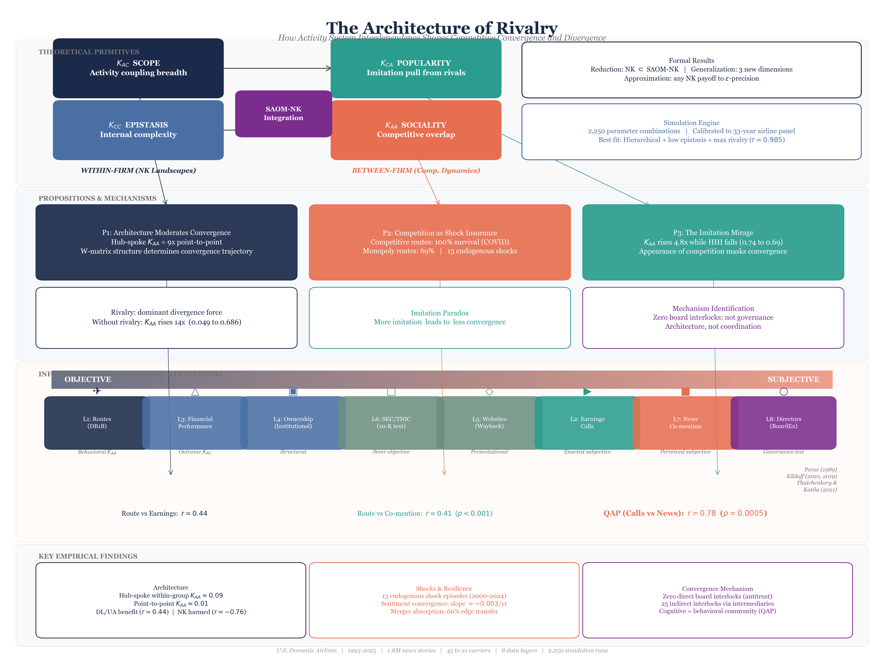
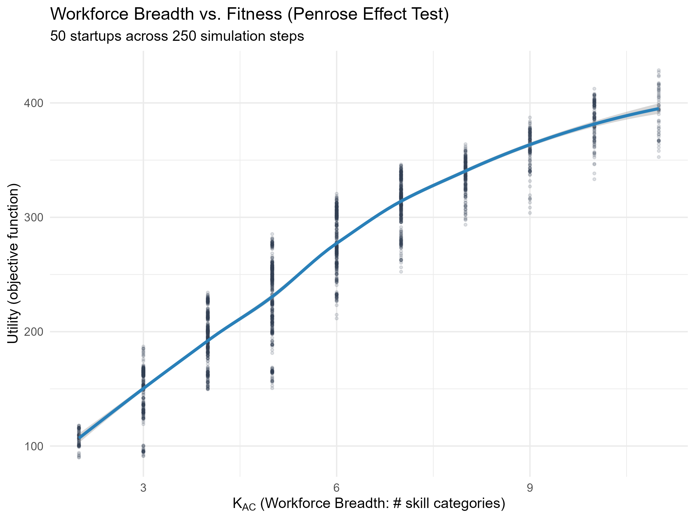
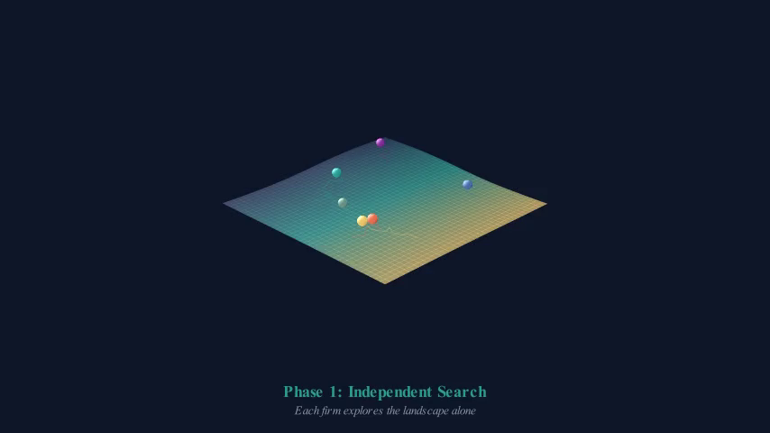
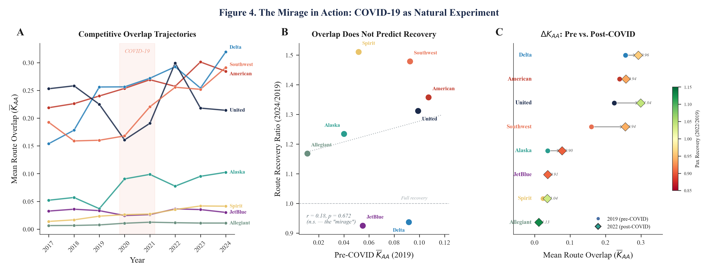
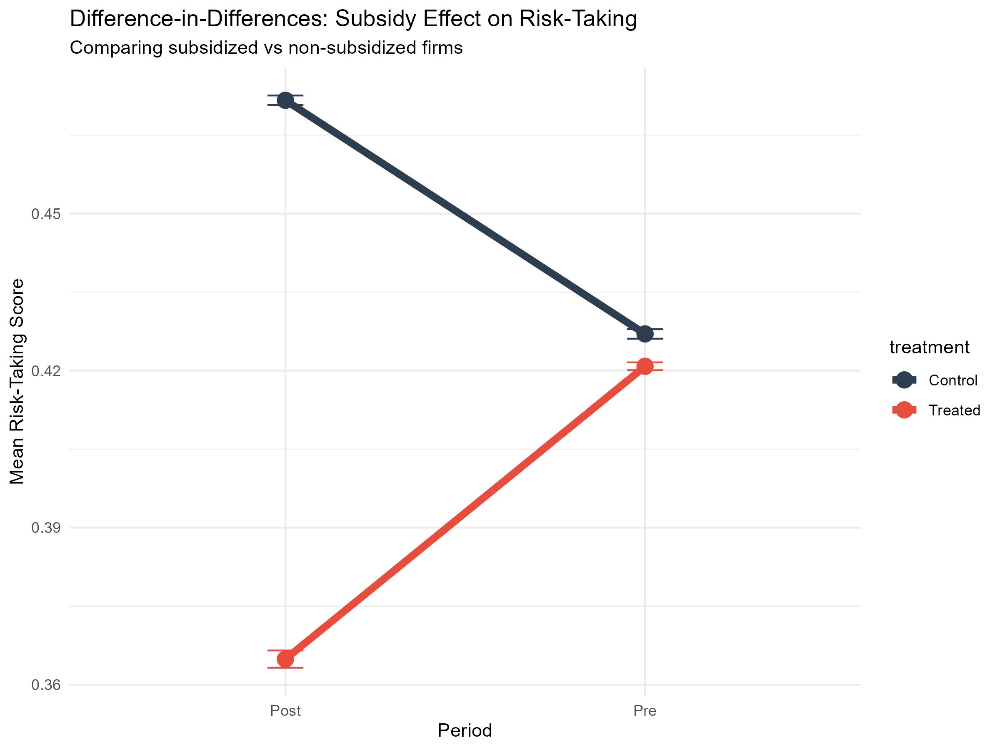
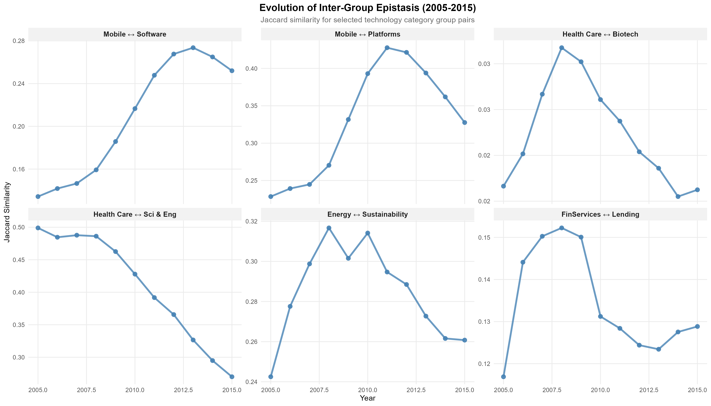

```{r setup, include=FALSE}
knitr::opts_chunk$set(
  collapse  = TRUE,
  comment   = "#>",
  warning   = FALSE,
  message   = FALSE,
  fig.width = 6.5,
  fig.height = 4.5,
  fig.align = "center",
  cache     = TRUE,
  cache.path = "searchnet-jss-cache/"
)
options(digits = 4)
```

```{r load-packages, include=FALSE, cache=FALSE}
library(searchnet)
library(ggplot2)
library(Matrix)
```


# Introduction

The NK fitness landscape model \citep{Kauffman1987, KauffmanWeinberger1989} has
become one of the most productive computational frameworks in strategic
management and organization theory.  Since \citet{Levinthal1997} demonstrated
that the NK model could illuminate the tension between exploration and
exploitation on rugged performance landscapes, hundreds of studies have deployed
it to investigate organizational adaptation, modular design, imitation, and
competitive search \citep{Baumann2019, Rivkin2000, SiggelkowRivkin2005}.

The model's appeal lies in its parsimony.  Two parameters---$N$, the number of
design choices or components, and $K$, the degree of epistatic interdependence
among them---generate landscapes ranging from smooth single-peaked surfaces
($K = 0$) to highly rugged terrains ($K = N - 1$) populated by many local
optima.  This parsimony has also become the model's principal liability.  Four
limitations recur across the literature.

First, the fitness landscape is **exogenous**: it is drawn once from a random
distribution and does not respond to the positions that agents occupy.  Firms
competing on the same landscape experience identical payoff surfaces regardless
of how many competitors share each component or how concentrated competitive
attention has become.  Second, **$K$ is a scalar** set by the modeler.  In
empirical organizational settings, interdependence is neither uniform nor fixed;
some components are tightly coupled while others operate nearly independently,
and coupling structures change as actors reconfigure their systems.  Third,
**multi-agent extensions** typically treat agents as independent searchers
navigating the same landscape, ignoring the social and competitive structure
through which firms observe, imitate, and crowd one another.  Fourth, the NK
model provides **no statistical framework** for parameter estimation from
empirical data, making it difficult to discipline simulations with observed
organizational behavior.

This paper introduces \pkg{searchnet}, an \proglang{R} package that addresses
all four limitations simultaneously.  The package reformulates the NK model as
a bipartite network of $M$ actors (firms, agents, decision-makers) affiliating
with $N$ components (technologies, resources, markets, design choices).  By
embedding this bipartite structure within a Stochastic Actor-Oriented Model
\citep[SAOM;][]{Snijders1996, SnijdersVdBuntSteglich2010}, the search
environment becomes a network data generation process whose topology---and
therefore whose fitness landscape---co-evolves with actors' affiliation
decisions.

This reformulation yields three contributions.

*Endogenization.*
The fitness landscape is no longer exogenous.  Landscape ruggedness emerges
from the structure of the bipartite network, which is itself shaped by actors'
strategic choices.  When multiple actors affiliate with the same components,
they create epistatic coupling through overlapping activity systems; when they
withdraw, coupling dissolves.

*Decomposition.*
The scalar $K$ is revealed as a special case of a four-dimensional coupled
degree system, denoted $\K$.  The four dimensions---actor scope ($K_{AC}$),
component popularity ($K_{CA}$), actor sociality ($K_{AA}$), and component
epistasis ($K_{CC}$)---are individually standard network statistics
\citep{Latapy2008, BorgattiEverett1997}, but the analytical leverage of the
$\K$ framework comes from treating them as a coupled system.  Because all four
derive from the same bipartite incidence matrix, a change in any one dimension
mechanically propagates to the others, exposing the transmission mechanism
through which micro-level affiliation decisions produce macro-level landscape
topology.

*Statistical infrastructure.*
Because the model is formalized as a SAOM, it inherits \pkg{RSiena}'s
\citep{Ripley2022} well-developed statistical machinery, including maximum
likelihood estimation, goodness-of-fit testing, and the capacity to be
estimated on empirical network panel data.

\noindent A full-scale empirical application using eight data layers from the
U.S.\ airline industry is reported in \citet{downing2026architecture}.

{width=85%}

The package provides an \proglang{R6}-based simulation engine, a functional
user API that abstracts away \pkg{RSiena}'s internal naming conventions,
comprehensive visualization through the $\K$-4 panel and 3D phase space,
utility decomposition diagnostics, exogenous shock infrastructure for
quasi-experimental designs, multi-wave Monte Carlo facilities, specification
robustness tools, an interactive strategy game mode, and a classroom teaching
module.  Eight vignettes accompany the package: a quick-start introduction,
theoretical foundations, a full simulation walkthrough with strategies and
shocks, a computational experiment design guide, a causal inference tutorial,
an NK validation guide, a Blume--Gibbs convergence tutorial, and a
Professional Development Workshop curriculum.

The remainder of this paper is organized as follows.  Section~2 reviews
the NK and SAOM literatures and positions the contribution.  Section~3 presents
the SaoMNK framework: the bipartite formulation, the $\K$ interpretive
framework, the SAOM objective function, and the rationale for choosing SAOMs
over ERGMs.  Section~4 describes the \pkg{searchnet} package architecture,
user API, visualization tools, diagnostics, animation pipeline, interactive
features, and proof registry.  Section~5
provides three worked illustrations and introduces basin geometry analysis
for the depth-width tradeoff.  Section~6 presents computational
benchmarks and scalability analysis.  Section~7 concludes.


# Background: NK models and SAOMs {#sec:background}

## The NK fitness landscape

The NK model \citep{Kauffman1987, KauffmanWeinberger1989} characterizes
performance landscapes with two parameters.  A system of $N$ binary components
(loci, design choices, technologies) generates $2^N$ possible configurations.
Each component $d$ makes a fitness contribution $f_d$ that depends not only on
its own state but also on the states of $K$ other components with which it is
epistatically linked.  Total fitness is the average contribution across all $N$
components.  When $K = 0$, each component contributes independently and the
landscape has a single global peak.  As $K$ increases toward $N - 1$, the
landscape becomes increasingly rugged, populated by exponentially many local
optima that trap myopic searchers.

\citet{Levinthal1997} introduced the NK model to management as a formalization
of the exploration--exploitation trade-off: agents that search locally
(single-bit mutations) on rugged landscapes quickly find nearby peaks but
rarely discover the global optimum, while agents that search more broadly
(multi-bit jumps) sacrifice short-run performance for a chance at higher peaks.
This insight has been extended to organizational design
\citep{SiggelkowRivkin2005}, imitation \citep{Rivkin2000}, modular
architectures \citep{EthirajLevinthal2004}, and competitive interaction
\citep{Lenox2006}.

Despite its generativity, the classical NK model imposes structural constraints
that limit its applicability to settings where search environments are dynamic,
socially embedded, or empirically observable.  The landscape is drawn once and
held fixed; $K$ is treated as a uniform scalar; agents search independently; and
there is no estimation framework linking the model to data.  Several extensions
have relaxed individual constraints---\citet{Gavetti2005} introduced cognitive
search, \citet{SiggelkowRivkin2005} embedded search in organizational
hierarchies, and \citet{Baumann2019} provided a comprehensive review---but no
existing framework addresses all four limitations simultaneously within a
unified statistical model.

## Stochastic Actor-Oriented Models

Stochastic Actor-Oriented Models \citep{Snijders1996,
SnijdersVdBuntSteglich2010} provide a continuous-time Markov model for the
co-evolution of social networks and behavior.  At each micro-step, a single
actor is selected according to a rate function, evaluates the marginal utility
of each possible tie change according to an objective function, and chooses
probabilistically via a multinomial logit rule.  The objective function takes the
general form

\begin{equation}\label{eq:saom-objective}
  f_i(\mathbf{B}) = \sum_k \theta_k \, s_{ik}(\mathbf{B}),
\end{equation}

\noindent where $s_{ik}(\mathbf{B})$ are network statistics computed from the
current network $\mathbf{B}$ and $\theta_k$ are parameters governing each
actor's preferences.  The parameters $\theta_k$ can be estimated from observed
panel data using the method of moments or maximum likelihood, implemented in the
\pkg{RSiena} package \citep{Ripley2022}.

SAOMs are well established in sociology and political science for modeling
friendship networks, advice networks, and inter-organizational partnerships.
They have been extended to bipartite (two-mode) networks
\citep{Koskinen2012}, where the model governs actors' affiliation decisions
with respect to events, organizations, or other categorical entities.
\pkg{searchnet} exploits this bipartite extension to model actors affiliating
with components in a search environment.

## Positioning \pkg{searchnet}

No existing \proglang{R} package provides the capability that \pkg{searchnet}
offers.  The \pkg{RSiena} package \citep{Ripley2022} implements SAOMs but
does not include bipartite search environment simulation with NK-style fitness
landscape analysis.  The \pkg{nkmodel} package \citep{Baumann2019nk}
implements classical NK models but not the network-embedded generalization.
\pkg{searchnet} bridges these two traditions, providing a simulation engine in
which the fitness landscape is an emergent property of actors' network positions
rather than an exogenously imposed parameter.


# The SaoMNK framework {#sec:framework}

\noindent \textbf{Notation.}
Throughout this paper we adopt the notation of \citet{downing2026architecture},
where the formal SAOM-NK proofs are developed in full.  The bipartite incidence
matrix is $\mathbf{B} \in \{0,1\}^{M \times N}$ with entries $b_{ij}$; the
NK configuration vector for a single agent is $\mathbf{x} \in \{0,1\}^N$; the
epistasis matrix is $\mathbf{E}$ (implemented in \pkg{RSiena} as the weight
matrix $\mathbf{W}$ of the \code{XWX} effect); component payoff functions are
$f_d$; and the logit precision parameter is $\beta > 0$.

## Bipartite network formulation {#sec:bipartite}

The classical NK model represents a system configuration as an $N$-dimensional
binary vector $\mathbf{x} = (x_1, x_2, \ldots, x_N)$ where $x_j \in \{0, 1\}$.
\pkg{searchnet} generalizes this by introducing $M$ actors, each of whom
maintains an affiliation vector.  The resulting system state is an
$M \times N$ binary matrix $\mathbf{B}$, where $b_{ij} = 1$ indicates that
actor $i$ affiliates with component $j$.  This matrix is the incidence matrix
of a bipartite network with actor nodes on one side and component nodes on the
other.

The bipartite representation has three immediate consequences.  First, it
naturally accommodates **multiple agents** searching simultaneously: each row
of $\mathbf{B}$ is an actor's configuration, and actors' configurations
interact through shared columns.  Second, it makes the **search environment
endogenous**: the pattern of affiliations determines which components are
coupled (via shared actors) and which actors are competitors (via shared
components).  Third, it provides the structural substrate for the SAOM engine:
$\mathbf{B}$ becomes the dependent variable in an evolving bipartite network
model.

## The $\K$ interpretive framework {#sec:k4}

The bipartite incidence matrix $\mathbf{B}$ generates four coupled degree
statistics, each of which is individually a standard network measure but whose
joint dynamics expose the mechanism through which micro-level search decisions
produce macro-level landscape structure.  Table~\ref{tab:k4} summarizes the
four dimensions.

\begin{table}[t]
\centering
\caption{The $\K$ coupled degree framework.  Each dimension is a standard
network statistic; the contribution is their joint treatment as a coupled
system.}
\label{tab:k4}
\begin{tabular}{llll}
\toprule
Dimension & Symbol & Interpretation & Network measure \\
\midrule
Actor scope & $K_{AC}$ & Components per actor & Bipartite row degree \\
Component popularity & $K_{CA}$ & Actors per component & Bipartite column degree \\
Actor sociality & $K_{AA}$ & Co-affiliating actors per actor & Actor projection degree \\
Component epistasis & $K_{CC}$ & Co-occurring components per component & Component projection degree \\
\bottomrule
\end{tabular}
\end{table}

{width=80%}

The classical NK parameter $K$ maps directly onto $K_{CC}$---the degree of a
node in the component--component projection network.  Two components share a
projection edge whenever at least one actor affiliates with both, and the
number of such edges incident on a focal component determines how many other
components epistatically affect its fitness contribution.  In the classical
model, this coupling structure is set exogenously by the modeler; in
\pkg{searchnet}, it emerges endogenously from the bipartite network and
co-evolves with the other three degree dimensions.

The analytical leverage of the $\K$ framework comes from treating these four
measures as a coupled system rather than examining any one in isolation.
Because all four derive from the same incidence matrix $\mathbf{B}$, they are
structurally linked.  A change in actor scope ($K_{AC}$) mechanically alters
component popularity ($K_{CA}$), which in turn reshapes both the actor
co-membership network ($K_{AA}$) and the component co-occurrence network
($K_{CC}$).  The projections are computed as:

\begin{align}
\mathbf{P}_{AA} &= \mathbf{B} \mathbf{B}^\top - \text{diag}(\mathbf{B} \mathbf{B}^\top), \label{eq:proj-actor} \\
\mathbf{P}_{CC} &= \mathbf{B}^\top \mathbf{B} - \text{diag}(\mathbf{B}^\top \mathbf{B}). \label{eq:proj-component}
\end{align}

The degree of actor $i$ in the actor projection $\mathbf{P}_{AA}$ is $K_{AA,i}
= \sum_{h \neq i} \mathbf{1}[(\mathbf{B}\mathbf{B}^\top)_{ih} > 0]$, and
symmetrically for $K_{CC,j}$ in the component projection.  Analyzing any single
measure in isolation obscures the cross-domain dependencies that link
actor behavior to landscape topology.

It is important to be precise about what the $\K$ framework contributes.  The
four statistics are individually well known in the bipartite network literature
\citep{Latapy2008, BorgattiEverett1997}.  The contribution is not statistical
but **interpretive**: $\K$ provides a theoretical bridge between the NK
landscape tradition in strategy---where $K$ is a scalar complexity
parameter---and the bipartite network tradition in sociology---where degree
distributions are descriptive summaries of affiliation structure.  By grouping
these four measures and tracking their joint evolution within a SAOM, the
framework makes visible the transmission mechanism through which actors'
strategic choices propagate into landscape ruggedness.

## SAOM objective function specification {#sec:objective}

The SAOM objective function in \pkg{searchnet} governs actors' affiliation
decisions.  At each micro-step, the selected actor $i$ evaluates the change in
objective function value for each possible tie change (creating or dissolving an
affiliation with one component) and selects the change that maximizes expected
utility, subject to a stochastic error term drawn from the type I extreme value
distribution.

The objective function takes the form of Equation~\ref{eq:saom-objective}, with
the following key statistics:

\begin{table}[t]
\centering
\caption{SAOM objective function statistics in \pkg{searchnet}.}
\label{tab:effects}
\begin{tabular}{llll}
\toprule
Statistic & RSiena name & Formula & Interpretation \\
\midrule
Density & \code{density} & $\sum_j b_{ij}$ & Baseline affiliation rate \\
Popularity & \code{inPop} & $\sum_j b_{ij} \sqrt{\sum_{h \neq i} b_{hj}}$ & Preference for popular components \\
Scope & \code{outAct} & $\sum_j b_{ij} \sqrt{\sum_{k \neq j} b_{ik}}$ & Scope expansion tendency \\
Epistasis & \code{XWX} & $\sum_j b_{ij} \sum_k w_{jk} b_{ik}$ & Exogenous component coupling \\
\bottomrule
\end{tabular}
\end{table}

The density effect serves as an intercept: a negative density parameter creates
baseline sparsity pressure, preventing actors from affiliating with all
components.  The popularity effect (\code{inPop}) creates preferential
attachment to components that many other actors already use.  The scope effect
(\code{outAct}) governs actors' tendency to expand or contract the breadth of
their affiliations.  The epistasis effect (\code{XWX}) introduces exogenous
component--component coupling via a modeler-supplied weight matrix $\mathbf{W}$
(denoted $\mathbf{E}$ in the formal proofs; see Section~\ref{sec:formal-properties});
actors derive utility from affiliating with components that are coupled to their
existing affiliations.

Actor-level heterogeneity enters through constant covariates attached to the
objective function.  A covariate vector $\mathbf{v}$ (e.g., encoding strategic
orientation) can modify the weight an actor places on popularity seeking
(\code{inPopX}), scope expansion (\code{egoX}), or component characteristics
(\code{altX}).  This mechanism allows the modeler to assign distinct strategic
profiles to different actors---for example, "exploiters" who preferentially
attach to popular components and "explorers" who expand into uncrowded niches.

The simulation proceeds via \pkg{RSiena}'s continuous-time Markov chain
algorithm.  Actors are selected according to a rate function (by default,
equal rates for all actors), and the selected actor evaluates all possible
single-tie changes, choosing according to a multinomial logit rule:

\begin{equation}\label{eq:choice}
  P(b_{ij} \to 1 - b_{ij}) =
  \frac{\exp\bigl(f_i(\mathbf{B}^{ij})\bigr)}
       {\sum_{j'} \exp\bigl(f_i(\mathbf{B}^{ij'})\bigr)},
\end{equation}

\noindent where $\mathbf{B}^{ij}$ denotes the network configuration obtained
by toggling actor $i$'s tie to component $j$.  The \code{search\_rsiena}
method passes the full structure model to \pkg{RSiena}'s
\code{siena07} function, which executes the continuous-time simulation
internally.  The \code{iterations\_per\_actor} parameter controls the total
number of micro-steps: $M \times$ \code{iterations\_per\_actor}.

For exogenous shocks, \pkg{searchnet} partitions the simulation timeline into
proportional segments.  At each segment boundary, the $\theta$ parameters are
updated to new values specified by the shock schedule.  The simulation then
continues from the current network state with the modified objective function,
preserving path dependence while allowing the researcher to model environmental
discontinuities.  This is equivalent to running sequential \pkg{RSiena}
simulations where each wave's initial state is the terminal state of the
previous wave.

## Mapping RSiena effects to strategic search concepts {#sec:glossary}

The preceding objective function uses \pkg{RSiena} effect names that are
standard in social network analysis but may be unfamiliar to strategy
researchers.  Table~\ref{tab:glossary} provides a systematic mapping between
RSiena effects available in \pkg{searchnet} and their strategic search
interpretations.  Each effect's parameter symbol links it to the corresponding
$\K$ dimension introduced in Section~\ref{sec:k4}, enabling researchers to
translate between the network estimation vocabulary and the strategy-theoretic
language of scope, complementarity, and imitation.

\begin{table}[t]
\centering
\caption{Mapping RSiena effects to strategic search concepts.  Parameters correspond to the SAOM objective function (Equation~\ref{eq:saom-objective}).  The $\K$ column indicates which coupled degree dimension each effect primarily governs.}
\label{tab:glossary}
\begin{tabular}{lllll}
\toprule
RSiena Effect & Parameter & $\K$ Dim. & Strategy Concept & Interpretation \\
\midrule
\code{density}      & $\theta_{\text{dens}}$  & ---        & Scope cost               & Negative = costly to hold activities; controls portfolio breadth \\
\code{outAct}       & $\theta_{\text{scope}}$ & $K_{AC}$   & Diminishing returns       & Quadratic penalty on actor degree (scope) \\
\code{inPop}        & $\theta_{\text{pop}}$   & $K_{CA}$   & Bandwagon / legitimacy    & Positive = prefer popular components; preferential attachment \\
\code{XWX}          & $\theta_{\text{epist}}$ & $K_{CC}$   & Complementarity / synergy & Reward for holding epistatically linked components \\
\code{simEgoInDist2}& $\theta_{\text{imit}}$  & $K_{AA}$   & Imitation / herding       & Positive = actors converge to similar portfolios \\
\code{egoX}         & $\theta_{\text{strat}}$ & ---        & Strategy heterogeneity    & Actor-level covariate modifying search behavior \\
\code{altX}         & $\theta_{\text{value}}$ & ---        & Component value           & Exogenous activity-level payoff differences \\
\code{cycle4}       & $\theta_{\text{close}}$ & $K_{AA}$   & Structural closure        & Triadic closure in the projected social network \\
\bottomrule
\end{tabular}
\end{table}

The table makes explicit the division of labor among effects.  The first four
rows---\code{density}, \code{outAct}, \code{inPop}, and \code{XWX}---are the
workhorses of most \pkg{searchnet} specifications.  Together they endogenize the
four $\K$ dimensions: scope cost sets the baseline, \code{outAct} introduces
diminishing returns to breadth, \code{inPop} creates demand-side herding toward
popular components, and \code{XWX} rewards configurations that exploit
exogenous complementarities.  The remaining effects allow the researcher to
layer on additional mechanisms: imitation (\code{simEgoInDist2}) induces
portfolio convergence among structurally similar actors, actor and component
covariates (\code{egoX}, \code{altX}) introduce heterogeneity, and
\code{cycle4} captures closure in the actor--actor projection of the bipartite
network.  By selecting which effects to include and setting their parameter
values, the researcher controls which strategic mechanisms are active in a given
simulation---a design choice whose consequences can be audited with the
diagnostic tools described in Section~\ref{sec:diagnostics}.


### Formal properties {#sec:formal-properties}

The SaoMNK framework rests on formal results that establish its relationship to
the classical NK model and to quantal response equilibrium.  We state the main
results here; complete proofs with all lemmas are provided in the Online Appendix
\citep[see also][]{downing2026architecture} (available as \code{inst/proofs/}
in the package; access via \code{searchnet\_proof()}).

\begin{description}

\item[Theorem 1 (Reduction).] The standard NK model is a degenerate special case
of the SAOM-NK model.  Specifically, the NK landscape and its adaptive walk are
recovered exactly under five restrictions: (R1)~$M = 1$ (single actor);
(R2)~$\mathbf{E} = \mathbf{A}$ (SAOM-NK epistasis matrix equals the NK
interaction matrix); (R3)~$\boldsymbol{\theta} = \mathbf{0}$ (all SAOM
parameters zero); (R4)~$\beta \to \infty$ (deterministic greedy choice);
(R5)~uniform component selection probability.

\item[Theorem 2 (Generalization).] SAOM-NK strictly generalizes the NK model
along three independent dimensions: (a)~multi-actor endogenous interaction
($M > 1$), (b)~endogenous landscape co-evolution through SAOM network
statistics, and (c)~bounded rationality with tunable search precision
($\beta \in (0, \infty)$).  The coupled degree vector
$\K = (K_{AC}, K_{CA}, K_{AA}, K_{CC})$ spans a strictly larger class of
fitness landscapes than the scalar $K$ parameterization.  The classical NK
model is recovered as a proper special case: NK $\subsetneq$ SAOM-NK.

\item[Theorem 3 (Approximation).] For any NK landscape
$(N, K, \mathbf{A}, \{f_d\}_{d=1}^N)$, there exists a parameterization
of the SAOM-NK model that reproduces the NK payoff structure to arbitrary
precision.  Three independent proof strategies establish this: (a)~constructive
existence via dummy covariates, (b)~actor heterogeneity substitution, and
(c)~universal approximation via mixed logit.

\item[Theorem 4 (SAOM--QRE Equivalence).] The SAOM multinomial logit choice
rule (Equation~\ref{eq:choice}) is isomorphic to a quantal response
equilibrium (QRE) in the bipartite affiliation game, establishing a
game-theoretic foundation for the statistical model.

\end{description}

\noindent Theorems~1--3 correspond to Theorems~1--3 in
\citet{downing2026architecture}; Theorem~4 is specific to this paper.
These results are applied empirically to U.S.\ airline competitive
dynamics in \citet{downing2026architecture}.

## Why SAOM over ERGM? {#sec:saom-ergm}

A natural question is why \pkg{searchnet} adopts the SAOM rather than the
exponential random graph model \citep[ERGM;][]{LusherKoskinenRobins2013} or its
temporal extension \citep[TERGM;][]{Hanneke2010} as its network engine.  The
choice follows directly from the theoretical premise of the NK tradition.

The NK model is fundamentally about **agents making strategic decisions**: an
actor evaluates alternative configurations and selects the one that maximizes
a fitness criterion.  The SAOM's rate-function architecture is the natural
formalization of this process.  At each micro-step, a single actor is selected,
evaluates the marginal utility of each possible tie change, and chooses
probabilistically according to a multinomial logit rule.  This actor-centric,
sequential-decision structure maps directly onto the local search process in NK
models, where an agent evaluates neighboring configurations and moves to the
best alternative.

ERGMs, by contrast, characterize the equilibrium distribution of network
configurations without specifying a generative decision process.  An ERGM
answers the question "what network structures are over-represented relative to
chance?" but does not model *who* makes *which* decision *when*.  For a
framework whose purpose is to endogenize landscape ruggedness through actors'
strategic choices, this equilibrium focus omits precisely the mechanism of
interest.

Beyond theoretical alignment, SAOMs offer practical advantages for the
simulation-based workflow that \pkg{searchnet} supports.  The SAOM's
micro-step chain produces a complete trajectory of network states, enabling
the researcher to track how $\K$ dimensions evolve over time, to identify
critical transitions, and to introduce shocks at precise points in the
simulation.  ERGM simulation, by contrast, generates draws from a stationary
distribution without temporal ordering, making path-dependent analysis
infeasible.

Finally, the SAOM's continuous-time formulation handles bipartite networks
with actor-level covariates naturally through \pkg{RSiena}'s existing
infrastructure.  While bipartite ERGMs exist \citep{WangPattison2009}, the
SAOM's treatment of bipartite networks as actor-driven affiliation processes
is better suited to the search-theoretic interpretation that motivates
\pkg{searchnet}.


# The \pkg{searchnet} package {#sec:package}

## Architecture {#sec:architecture}

\pkg{searchnet} is built on \proglang{R6} classes organized in a two-level
inheritance hierarchy:

\begin{description}
\item[\code{SaomNkRSienaBiEnv\_base}] Core environment initialization,
  bipartite matrix management, graph construction, projection computation, and
  utility helpers (toggle, Jaccard, existence checks).  This base class
  manages the $M \times N$ incidence matrix, constructs the \pkg{RSiena} data
  objects, and provides low-level network operations.

\item[\code{SaomNkRSienaBiEnv}] Full simulation engine inheriting from the
  base class, adding the \code{search\_rsiena()} simulation method, chain
  statistics processing, $\K$-4 degree computation, fitness landscape
  evaluation, shock handling, multi-wave experiment infrastructure, and the
  visualization interface.
\end{description}

Supporting modules provide separation of concerns:

\begin{itemize}
\item \code{saomnk-api.R}: User-facing functional API (\code{saomnk\_env},
  \code{saomnk\_model}, \code{saomnk\_run}) that wraps the R6 internals.
\item \code{saomnk-diagnostics.R}: Specification robustness tools (SAI, CFC,
  DGF) adapted from the companion \pkg{netcheck} framework.
\item \code{saomnk-experiments.R}: \code{SaoMNKexperiments} R6 class for batch
  Monte Carlo simulation management.
\item \code{plot-*.R}: Eight modular plotting files (\code{plot-utility.R},
  \code{plot-degrees.R}, \code{plot-exploration.R}, \code{plot-markets.R},
  \code{plot-multiwave.R}, \code{plot-shocks.R}, \code{plot-snapshots.R},
  \code{plot-phase-space.R}) containing visualization functions.
\item \code{searchnet-game.R}: Strategy game mode providing an interactive
  game loop where a human player controls one firm and competes against AI
  opponents that follow SAOM-NK logit choice rules.
\item \code{searchnet-teaching.R}: Classroom teaching module for Capsim-style
  strategy simulations supporting multiple industry presets, difficulty
  levels, and exogenous shocks.
\item \code{utils.R}: Standalone helper functions.
\end{itemize}

The package follows standard \proglang{R} packaging conventions with
\code{DESCRIPTION}, \code{NAMESPACE}, a \pkg{testthat} test suite (300 tests
across 23 files), and eight vignettes.  All exported functions are prefixed
with \code{saomnk\_} or \code{searchnet\_} to avoid namespace collisions.

## User API {#sec:api}

A central design goal of \pkg{searchnet} is to provide a clean functional
interface that shields users from the complexity of \pkg{RSiena}'s internal
naming conventions and the R6 class hierarchy.  The workflow follows three
steps: environment creation, model specification, and simulation execution.

### Step 1: Create the search environment

The \code{saomnk\_env()} function initializes a bipartite search environment:

```{r api-env}
env <- saomnk_env(M = 8, N = 12, density = 0, seed = 42)
```

This creates a \code{SaomNkRSienaBiEnv} object representing 8 actors and 12
components, starting from an empty network (all actors unaffiliated).  The
\code{seed} argument ensures reproducibility of the initial network draw.

### Step 2: Specify the structure model

The \code{saomnk\_model()} function builds the SAOM objective function
specification using intuitive parameter names:

```{r api-model}
## Define a modular epistasis matrix: 4 blocks of 3 components
K_matrix <- saomnk_block_diagonal(12, 4)

## Specify the model
mod <- saomnk_model(
  density    = -0.5,     # sparsity pressure
  popularity =  0.2,     # preferential attachment
  scope      =  0.1,     # scope expansion
  epistasis_matrix = K_matrix,
  epistasis_weight = 0.05
)
mod
```

Users never need to write internal references such as
\code{"self\$bipartite\_rsienaDV"} or construct nested covariate lists
manually.  The function assembles the complete \pkg{RSiena} structure model
internally.  Actor strategy heterogeneity is specified through the
\code{strategies} argument:

```{r api-model-strat}
## Heterogeneous actors: varying scope and popularity preferences
mod_strat <- saomnk_model(
  density    = -0.3,
  popularity =  0.2,
  scope      =  0.1,
  epistasis_matrix = K_matrix,
  epistasis_weight = 0.05,
  strategies = list(
    egoX   = rep(c(-1, 0, 1, 0), length.out = 8),
    inPopX = rep(c( 1, 0,-1, 0), length.out = 8)
  )
)
```

### Step 3: Run the simulation

The \code{saomnk\_run()} function executes the SAOM simulation:

```{r api-run, cache=TRUE}
saomnk_run(env, mod, steps_per_actor = 30, seed = 12345)
```

The function passes the structure model to the internal
\code{search\_rsiena()} method, runs the continuous-time SAOM simulation
via \pkg{RSiena}, extracts chain statistics, and computes the $\K$-4 degree
trajectories.  The \code{env} object is modified in place (standard R6
semantics) and returned invisibly.

## Visualization {#sec:visualization}

\pkg{searchnet} provides a comprehensive visualization toolkit organized
around four analytical perspectives.

### The $\K$-4 panel

The signature visualization is the coupled degree panel, which displays
all four $\K$ dimensions over the simulation timeline:

```{r k4-panel, fig.height=8, fig.width=8, fig.cap="The $\\{K\\}$-4 coupled degree panel showing actor scope ($K_{AC}$), component popularity ($K_{CA}$), actor sociality ($K_{AA}$), and component epistasis ($K_{CC}$) trajectories over 240 simulation micro-steps.  Each line represents a single actor or component; the heavy line is the LOESS-smoothed mean."}
saomnk_plot_k4(env, smooth = 0.3)
```

The panel reveals the structural coupling between dimensions: as actors
expand scope ($K_{AC}$), they mechanically increase component popularity
($K_{CA}$), which in turn elevates both actor sociality ($K_{AA}$) and
component epistasis ($K_{CC}$).  This coupling is the core mechanism through
which individual search decisions endogenize the fitness landscape.

{width=45%}
{width=45%}

### Network snapshots

The \code{saomnk\_plot\_snapshots()} function renders the bipartite
network at selected simulation steps, along with its unipartite projections:

```{r snapshots, fig.height=4, fig.width=10, fig.cap="Network snapshots at the initial state, midpoint, and final state of the simulation.  Top row: bipartite actor-component network.  Bottom rows: actor co-membership projection ($K_{AA}$) and component co-occurrence projection ($K_{CC}$)."}
saomnk_plot_snapshots(env, steps = c(1, 120, 240))
```

### Utility decomposition

The \code{saomnk\_plot\_utility()} function decomposes each actor's total
objective function value into contributions from individual network statistics:

```{r utility, fig.height=5, fig.width=8, fig.cap="Utility decomposition showing each actor's objective function value broken into contributions from density, popularity, scope, and epistasis effects over the simulation timeline."}
saomnk_plot_utility(env, smooth = 0.35)
```

This decomposition provides direct insight into the strategic trade-offs
governing search behavior: an actor whose utility is dominated by the epistasis
term is searching for complementary components, while one dominated by the
popularity term is following the crowd.

### 3D phase space

The \code{saomnk\_plot\_phase\_space\_3d()} function renders the simulation
trajectory in a three-dimensional Network $\times$ Behavior $\times$ Fitness
space, where the three axes correspond to structural properties (e.g.,
$K_{AC}$ or density), behavioral properties (e.g., exploration rate or scope
change), and outcome measures (utility or NK fitness).  The resulting
``SCP(t) trajectory'' traces each actor's path through this space over
simulation time, providing an integrated view of how structural position,
behavioral strategy, and performance co-evolve.  Supporting functions include
\code{saomnk\_plot\_phase\_heatmap()} for density-based projections,
\code{saomnk\_plot\_phase\_evolution()} for animated trajectories,
\code{saomnk\_plot\_phase\_comparison()} for juxtaposing multiple simulation
runs, and \code{searchnet\_export\_phase\_space()} for Manim-compatible data
export.

## Diagnostics {#sec:diagnostics}

\pkg{searchnet} includes three specification robustness diagnostics, adapted
from the \pkg{netcheck} framework \citep{Downing2025netcheck} and fully
implemented within the package.

### Specification Agreement Index (SAI)

The Specification Agreement Index quantifies how robust a network model
estimate is across a multiverse of defensible specifications.  For each
effect $k$, the SAI computes:

\begin{align}
\text{SAI}_{\text{sign}}(k) &= \frac{|\sum_s w_s \cdot \text{sgn}(\hat{\theta}_{ks})|}{\sum_s w_s}, \\
\text{SAI}_{\text{sig}}(k) &= \frac{\sum_s w_s \cdot \mathbf{1}(p_{ks} < \alpha)}{\sum_s w_s}, \\
\text{SAI}_{\text{composite}}(k) &= \text{SAI}_{\text{sign}}(k) \times \text{SAI}_{\text{sig}}(k),
\end{align}

\noindent where $s$ indexes specifications, $w_s$ are optional
goodness-of-fit-based weights, and $\text{sgn}$ returns the sign of the
estimate.  $\text{SAI}_{\text{sign}}$ ranges from 0 (half positive, half
negative across specifications) to 1 (unanimous sign).
$\text{SAI}_{\text{sig}}$ ranges from 0 (never significant) to 1 (always
significant).  The composite provides a single summary measure of robustness.

### Cross-Framework Concordance (CFC)

CFC assesses agreement between SAOM and TERGM estimates for the same
network process, providing a check on whether substantive conclusions are
framework-dependent.  For each effect, CFC reports the proportion of
specification pairs where the two frameworks agree in sign and significance.

### Density-GOF Frontier (DGF)

The DGF diagnostic identifies the network density thresholds at which model
goodness-of-fit degrades, helping researchers assess whether their network's
density falls within the well-estimated region for a given SAOM specification.

## Manim animation pipeline {#sec:manim}

For presentation and pedagogical purposes, \pkg{searchnet} exports simulation
data in formats compatible with the \pkg{Manim} animation library
\citep{Manim2022}.  The exported data includes per-step bipartite matrices,
projection networks, degree trajectories, and utility decompositions.  The
package ships with 16 ready-to-render Manim scene classes organized across
six Python modules: bipartite network evolution, $\K$-4 degree trajectories,
3D fitness landscapes, shock response dynamics, 3D phase space trajectories,
a seven-panel research dashboard (covering $\K$ evolution, bipartite
structure, fitness surfaces, information funnels, shock response, and
game-theoretic equilibria), and four Blume--Gibbs scenes that animate the
statistical-mechanical foundations of convergence (Ising--logit
correspondence, temperature dials, Gibbs potential surfaces, and convergence
diagnostics).  This pipeline is accessed through the
\code{saomnk\_export\_manim()} method on the environment object and the
\code{searchnet\_export\_phase\_space()} function for phase space data.

{width=45%}
{width=45%}

## Interactive features {#sec:interactive}

\pkg{searchnet} includes two interactive modules that extend the simulation
engine from a research tool to an instructional platform.

**Strategy game mode.**
The \code{searchnet\_game\_*} family of functions (five exported functions)
provides an interactive game loop where a human player controls one firm and
competes against AI opponents that follow the SAOM conditional-logit choice
rule.  The player initializes a game with
\code{searchnet\_game\_init()}, specifying the number of firms, difficulty
level (\code{"easy"}, \code{"medium"}, \code{"hard"}, mapping to logit
precision $\beta \in \{0.5, 2, 10\}$), and game objective (maximize fitness,
minimize competitive overlap, survive an exogenous shock, or outperform the
quantal response equilibrium prediction).  At each round, the player queries
available moves via \code{searchnet\_game\_available\_moves()}, selects an
action, and advances the simulation with \code{searchnet\_game\_step()}.  AI
opponents respond simultaneously according to the SAOM logit rule, and the
scoreboard (\code{searchnet\_game\_scoreboard()}) tracks all firms' $\K$
statistics.  After the final round, \code{searchnet\_game\_summary()} compiles
trajectory data suitable for replay visualization.

**Classroom teaching module.**
The \code{searchnet\_classroom\_*} family (six exported functions) supports
Capsim-style strategy simulations for classroom use.  An instructor
initializes a session with \code{searchnet\_classroom\_init()}, choosing from
industry presets (airline, tech, pharma) or custom parameters, and specifying
a difficulty level that controls the number of AI firms and optional exogenous
shocks.  Each student controls one firm, submitting portfolio decisions (add
or drop activities) through \code{searchnet\_classroom\_submit()}.  Once all
students have submitted, \code{searchnet\_classroom\_advance()} executes
decisions simultaneously, runs AI opponent responses via SAOM ministeps, and
updates the class leaderboard.  At the end of the game,
\code{searchnet\_classroom\_debrief()} generates a suite of reports: final
rankings, round-by-round histories, $\K$-4 panels, decision logs, and shock
records.

## Proof registry {#sec:proofs}

The package ships with a complete formal verification chain for the SaoMNK
framework, accessible via \code{searchnet\_proof()}.  The proof registry
(\code{inst/proofs/PROOF\_TABLE.md}) enumerates 81 logical steps---from axioms
through definitions, lemmas, and propositions to the four main
theorems---organized so that every result can be traced backward through its
dependencies to foundational axioms.  This self-contained proof chain
provides reviewers and users with a verifiable logical scaffold for the
theoretical claims summarized in Section~\ref{sec:formal-properties}.


# Illustrations {#sec:illustrations}

## Reproducing Levinthal (1997) {#sec:levinthal}

The first illustration establishes that \pkg{searchnet} can reproduce the
core dynamics of the classical NK model under appropriate parameter settings.
We configure a single-agent environment with no endogenous network effects,
leaving only the exogenous epistasis matrix active.  This setting strips away
all SAOM-specific mechanisms, reducing the model to a single searcher navigating
a landscape whose ruggedness is determined solely by the exogenous coupling
matrix---the functional equivalent of the classical NK search process.

```{r levinthal-setup, cache=TRUE}
## Single agent, 12 components, empty start
env_nk <- saomnk_env(M = 1, N = 12, density = 0, seed = 1234)

## Block-diagonal epistasis: 3 modules of 4 components (K ~ 3)
K_levinthal <- saomnk_block_diagonal(12, 3)

## Only epistasis active; no endogenous effects
mod_nk <- saomnk_model(
  density    = -0.3,
  popularity = 0,
  scope      = 0,
  epistasis_matrix = K_levinthal,
  epistasis_weight = 0.15
)

saomnk_run(env_nk, mod_nk, steps_per_actor = 100, seed = 42)
```

Under this parameterization, the agent's search trajectory exhibits the
signature features of NK dynamics: rapid initial improvement as the agent
discovers complementary component clusters, followed by convergence to a
local optimum where no single-component change improves utility.  The K-4
panel (not shown for $M = 1$) reduces to the $K_{AC}$ trajectory (actor
scope) and the $K_{CC}$ trajectory (epistasis), with the latter reflecting
the fixed block-diagonal structure.

```{r levinthal-degrees, fig.height=3.5, fig.width=6, fig.cap="Actor scope ($K_{AC}$) trajectory for a single agent searching on a block-diagonal epistasis landscape.  The trajectory shows rapid scope expansion followed by stabilization---the SAOM equivalent of convergence to a local optimum on a rugged NK landscape."}
env_nk$plot_actor_degrees(loess_span = 0.5)
```

This result provides face validity: when all endogenous network effects are
disabled, \pkg{searchnet} recovers the qualitative behavior of the classical
NK model.  The landscape is effectively exogenous (determined by the fixed
$\mathbf{W}$ matrix), search is local (single-tie changes), and convergence
reflects the trapping property of rugged landscapes.

A deeper convergence analysis is provided in the Blume tutorial vignette
(\code{vignette("saomnk-blume-tutorial")}), which establishes the
statistical-mechanical foundations of the SAOM-NK choice rule by connecting it
to the Blume--Capel model \citep{Blume1993}, Gibbs measures, and the
Ising--logit correspondence.  The tutorial provides computational verification that the
SAOM Markov chain satisfies detailed balance with respect to the Gibbs
distribution, confirming convergence to the correct stationary distribution.

## Endogenous landscape with heterogeneous strategies {#sec:endogenous}

The second illustration activates the full \pkg{searchnet} machinery to
demonstrate endogenous landscape formation.  We configure 12 actors searching
over 12 components with active density, popularity, scope, and epistasis
effects, plus heterogeneous strategy covariates.

```{r endogenous-setup, cache=TRUE}
env_endog <- saomnk_env(M = 12, N = 12, density = 0, seed = 1234)

K_modular <- saomnk_block_diagonal(12, 4)

mod_endog <- saomnk_model(
  density    = -0.3,
  popularity =  0.2,
  scope      =  0.1,
  epistasis_matrix = K_modular,
  epistasis_weight = 0.02,
  strategies = list(
    egoX   = rep(c(-1, 0, 1), length.out = 12),
    inPopX = rep(c( 1, 0,-1), length.out = 12)
  )
)

saomnk_run(env_endog, mod_endog, steps_per_actor = 30, seed = 12345)
```

```{r endogenous-k4, fig.height=8, fig.width=8, fig.cap="$\\{K\\}$-4 panel for a 12-actor, 12-component simulation with heterogeneous strategies.  Unlike the exogenous case, all four degree dimensions co-evolve: actors with high scope-expansion tendency ($K_{AC}$) drive up component popularity ($K_{CA}$), which mechanically increases both actor sociality ($K_{AA}$) and component epistasis ($K_{CC}$).  Note the dispersion across actors and components, reflecting the heterogeneous strategy profiles."}
saomnk_plot_k4(env_endog, smooth = 0.3)
```

The K-4 panel now reveals the core mechanism that distinguishes \pkg{searchnet}
from the classical NK model.  The four degree trajectories are structurally
coupled: actors with positive scope expansion weights (high \code{egoX}) rapidly
increase $K_{AC}$, which mechanically elevates $K_{CA}$ for the components they
select, which in turn increases $K_{AA}$ (more actors share components) and
$K_{CC}$ (more components co-occur via shared actors).  Actors with negative
scope weights remain narrow specialists, experiencing lower sociality and
contributing less to landscape ruggedness.

The resulting $K_{CC}$ distribution---the classical complexity parameter $K$---is
not a single number but a heterogeneous vector that emerges from the
interaction of actor strategies, component popularity dynamics, and the
exogenous epistasis matrix.  This is the endogenization that the $\K$ framework
makes visible.

```{r endogenous-utility, fig.height=5, fig.width=8, fig.cap="Utility decomposition for the heterogeneous strategy simulation.  Actors' total utility is broken into contributions from density (sparsity pressure), popularity (preferential attachment payoff), scope (breadth payoff), and epistasis (complementarity payoff).  The divergent profiles reflect heterogeneous strategic orientations."}
saomnk_plot_utility(env_endog, smooth = 0.35)
```

## Exogenous shocks {#sec:shocks}

The third illustration demonstrates \pkg{searchnet}'s shock infrastructure.
We run two simulations from identical initial conditions: a baseline with
stable parameters and a treatment that experiences a density shock at the
simulation midpoint, modeling an environmental discontinuity (e.g., a
regulatory change that increases the cost of broad scope).

```{r shock-setup, cache=TRUE}
env_base <- saomnk_env(M = 6, N = 8, density = 0, seed = 42)
env_shock <- saomnk_env(M = 6, N = 8, density = 0, seed = 42)

K_small <- saomnk_block_diagonal(8, 2)
mod_base <- saomnk_model(
  density = -0.5,
  epistasis_matrix = K_small,
  epistasis_weight = 0.5
)

## Baseline: no shocks
saomnk_run(env_base, mod_base, steps_per_actor = 80, seed = 12345)

## Shocked: density drops from -0.5 to -2.0 at midpoint
shock_baseline <- saomnk_shock("density", parameter = -0.5, portion = 1)
shock_event    <- saomnk_shock("density", parameter = -2.0, portion = 1)

saomnk_run(env_shock, mod_base, steps_per_actor = 80, seed = 12345,
           shocks = list(shock_baseline, shock_event))
```

```{r shock-comparison, fig.height=8, fig.width=8, fig.cap="Baseline (left column) vs.\\ shocked (right column) $\\{K\\}$-4 panels.  The density shock at the midpoint (dashed vertical line) creates a visible structural break in all four degree trajectories.  Increased sparsity pressure compresses actor scope, which propagates through component popularity, actor sociality, and component epistasis."}
## Display baseline K-4 panel
saomnk_plot_k4(env_base, smooth = 0.3)
```

```{r shock-treatment, fig.height=8, fig.width=8}
## Display shocked K-4 panel
saomnk_plot_k4(env_shock, smooth = 0.3)
```

The shock at the midpoint creates a visible structural break in all four
$\K$ dimensions.  The increased density penalty (from $-0.5$ to $-2.0$)
intensifies sparsity pressure, causing actors to shed affiliations.  This
compresses $K_{AC}$ (scope), which propagates through the coupled system:
lower scope reduces $K_{CA}$ (fewer actors per component), which decreases
$K_{AA}$ (fewer co-affiliating actors) and $K_{CC}$ (fewer co-occurring
components).  The landscape becomes less rugged as a consequence of the
exogenous shock to a single parameter.

This kind of quasi-experimental comparison---identical starting conditions
with and without a parameter intervention---is the basis for difference-in-differences analyses of search dynamics, a workflow that
\pkg{searchnet} supports natively through its shock infrastructure and
multi-wave simulation capabilities.

{width=80%}


## From shocks to causal inference {#sec:causal}

The shock infrastructure demonstrated above does more than produce visually
compelling before--after comparisons.  Because \code{saomnk\_run} records the
full actor $\times$ step $\times$ treatment history, shocked simulations
generate panel data with the same structure required by standard causal
inference estimators.  The $\theta$-shock partitions the simulation timeline
into a pre-treatment period (steps before the shock) and a post-treatment
period (steps after), while the researcher controls which actors are
treated---either directly through parameter heterogeneity or indirectly through
network position at the time of the shock.

\pkg{searchnet} provides helper functions that extract this panel structure
and interface with the \pkg{did} package \citep{CallawayS2021}, which
implements the \citet{CallawayS2021} estimator for difference-in-differences
with staggered treatment adoption.  The workflow proceeds in three steps:
extract a panel data frame from the shocked environment, estimate group--time
average treatment effects, and visualize the results.

```{r causal-panel, cache=TRUE, eval=TRUE}
## Extract panel data from the shocked simulation (env_shock from Section 5.3)
panel <- tryCatch(
  searchnet_causal_panel(env_shock, shock_step = 40, outcome = "utility",
                         treated_actors = 1:3),
  error = function(e) {
    message("searchnet_causal_panel not yet available: ", conditionMessage(e))
    NULL
  }
)

if (!is.null(panel)) {
  str(panel)
}
```

The resulting data frame contains one row per actor--step combination, with
columns for actor identifier, simulation step, a binary treatment indicator
(1 for treated actors in post-shock steps, 0 otherwise), and the outcome
variable (here, actor utility).  This is precisely the structure expected by
\code{att\_gt} in the \pkg{did} package.

```{r causal-did, cache=TRUE, eval=TRUE, fig.cap="Difference-in-differences estimates from the shocked simulation.  The plot shows group--time average treatment effects on actor utility, with 95\\% pointwise confidence intervals.  The vertical dashed line marks the shock step."}
if (!is.null(panel) && requireNamespace("did", quietly = TRUE)) {
  did_result <- tryCatch({
    searchnet_did(panel)
  }, error = function(e) {
    message("DID estimation requires the 'did' package: ", conditionMessage(e))
    NULL
  })

  if (!is.null(did_result)) {
    tryCatch(
      searchnet_causal_plot(did_result),
      error = function(e) message("Causal plot failed: ", conditionMessage(e))
    )
  }
}
```

{width=80%}

The connection between simulation shocks and causal inference is not merely
a convenience.  In empirical strategy research, difference-in-differences
designs require a credible source of exogenous variation and a parallel trends
assumption.  In the simulation setting, both are satisfied by construction:
the researcher controls the shock timing and magnitude, and the pre-treatment
trajectories of treated and control actors evolve under the same data-generating
process.  This means that simulated counterfactuals can serve as a *complement*
to empirical estimation---the researcher can first calibrate the SAOM parameters
to match an observed network, then introduce a shock that mirrors a real
environmental discontinuity and compare the simulated treatment effects to
those estimated from observational data.

For a complete treatment of the causal inference workflow, including staggered
adoption designs, sensitivity analysis, and integration with empirical panel
data, see the \code{vignette("causal-inference", package = "searchnet")}.


## Basin geometry and the depth-width tradeoff {#sec:basins}

The \pkg{searchnet} package provides tools for analyzing the geometry of
fitness landscape basins---regions of the configuration space that converge
to local optima under gradient ascent.  Basin analysis quantifies two
fundamental properties of competitive positions.

**Basin depth** measures the fitness gap between a local peak and its basin
boundary:
\begin{equation}\label{eq:basin-depth}
  \text{Depth}(p) = F(p) - \frac{1}{|\partial B(p)|} \sum_{x \in \partial B(p)} F(x),
\end{equation}
where $\partial B(p)$ is the boundary of basin $B(p)$.  Depth corresponds
to the resource-based view's concept of competitive advantage sustainability
\citep{barney1991firm}.

**Basin width** measures the mean Hamming distance of basin members from the
peak:
\begin{equation}\label{eq:basin-width}
  \text{Width}(p) = \frac{1}{|B(p)|} \sum_{x \in B(p)} d_H(x, p).
\end{equation}
Width captures strategic flexibility---the number of distinct configurations
that converge to the same competitive outcome.

### Computing basin geometry

The \code{compute\_fitness\_landscape()} method enumerates configurations
and identifies local peaks:

```{r basin-landscape, eval=FALSE}
env <- SaomNkRSienaBiEnv$new(list(M = 8, N = 8, BI_PROB = 0.4, rand_seed = 42))
env$compute_fitness_landscape(n_landscapes = 1)

## Extract landscape data
landscape <- env$fitness_landscape[1,,]
N <- env$N
configs  <- landscape[, 1:N]
fitness  <- landscape[, 2*N + 1]
is_peak  <- landscape[, 2*N + 2] == 1
```

Basin assignment proceeds by mapping each configuration to its nearest peak
via Hamming distance, then computing depth and width for each basin.

### The depth-width tradeoff

A key theoretical result emerges from varying epistasis (the NK parameter
$K$).  As $K$ increases, the landscape becomes more rugged: basins
proliferate, deepen, and narrow.  This creates a fundamental tradeoff:

\begin{itemize}
\item High $K$: deep, narrow basins---strong competitive moats but limited
  strategic flexibility.
\item Low $K$: shallow, wide basins---weak moats but high adaptability.
\end{itemize}

\noindent Figure~\ref{fig:depth-width} illustrates this tradeoff.  Each
point represents a basin; size encodes population.  The diagonal separates
exploitation-dominant positions (upper-left) from exploration-dominant
positions (lower-right).

```{r depth-width, eval=FALSE, fig.cap="Depth-width scatter for fitness landscape basins.  Each point is a basin; marker size is proportional to the number of configurations in the basin.  The diagonal separates exploitation-dominant (upper-left) from exploration-dominant (lower-right) positions.\\label{fig:depth-width}"}
par(mar = c(5, 5, 3, 2))
plot(basin_width, basin_depth,
     pch = 19, cex = sqrt(basin_pop),
     col = adjustcolor("steelblue", 0.7),
     xlab = "Basin Width (mean Hamming distance)",
     ylab = "Basin Depth (fitness gap to rim)")
abline(a = 0, b = 1, lty = 2, col = "gray50")
```

### Landscape erosion under shocks

When shocks modify the interaction matrix $\mathbf{W}$, the landscape
reshapes.  The \pkg{searchnet} shock infrastructure enables systematic
measurement of **landscape erosion**:
\begin{equation}\label{eq:erosion}
  \text{Erosion}(p) = \text{Depth}_{\mathbf{W}_0}(p) - \text{Depth}_{\mathbf{W}_1}(p).
\end{equation}

\noindent Positive erosion indicates VRIO advantage degradation.  The
\code{shock\_theta\_matrix()} function implements regime changes at
designated iterations, enabling pre- vs.\ post-shock basin comparison
within a single simulation run.

### Connection to strategic management theory

Basin geometry bridges two dominant theories:

\begin{itemize}
\item The \emph{resource-based view} \citep{barney1991firm} predicts that
  deep basins sustain competitive advantage---partial imitation yields much
  lower fitness.
\item \emph{Dynamic capabilities} \citep{teece1997dynamic} become necessary
  when landscape erosion reduces basin depth below a viability threshold.
\end{itemize}

\noindent The depth-width ratio $\text{Depth}(p) / \text{Width}(p)$
operationalizes the exploitation--exploration tradeoff at the landscape
level: high ratios favor exploitation (strong position, stay put), low
ratios favor exploration (weak position, search for new peaks).


## Empirical calibration via SAOM parameter bridge {#sec:calibration}

The \pkg{searchnet} package includes a calibration bridge that converts
fitted SAOM parameters from empirical network panel data into calibrated
SaoMNK simulation environments.  This enables researchers to run validated
counterfactual simulations using empirically grounded parameter estimates
rather than ad hoc parameter choices.

### Parameter mapping

Both frameworks use the actor-oriented conditional logit utility
\begin{equation}\label{eq:calibration-utility}
  U_i(x) = \sum_k \theta_k \, s_{ik}(x),
\end{equation}
where $s_{ik}(x)$ is the network statistic for effect $k$.  The bridge
maps \pkg{RSiena}'s $\hat{\theta}$ vector to \pkg{searchnet}'s structure
model effects.  For shared effects the mapping is direct:

\begin{table}[ht]
\centering
\begin{tabular}{llc}
\toprule
SAOM Effect & SaoMNK Effect & Transformation \\
\midrule
\code{density}   & \code{density}    & $\beta = \theta \cdot \alpha$ \\
\code{inPopSqrt} & \code{inPop}      & $\beta = \theta \cdot \alpha$ \\
\code{gwespFF}   & \code{transTriads} & $\beta = \theta \cdot \alpha$ \\
\code{simX}      & \code{egoX}       & $\beta = \theta \cdot \alpha$ \\
\code{cycle3}    & \code{cycle4}     & $\beta = \theta \cdot \alpha$ (bipartite analog) \\
\bottomrule
\end{tabular}
\caption{Parameter mapping between RSiena and \pkg{searchnet}. $\alpha$ is
an optional scale factor applied during calibration.}
\label{tab:param-mapping}
\end{table}

### Code example

The calibration workflow involves three steps: parameter conversion,
environment initialization from empirical data, and counterfactual
execution.

```{r calibration-example, eval=FALSE}
## Convert fitted SAOM parameters to SaoMNK
bridge <- saom_to_saomnk(saom_fit, scale_factor = 1.0)
print(bridge$mapping_table)

## Initialize environment from empirical data
env_data <- empirical_to_saomnk_env(mi_data, wave = 5)

## Run calibrated counterfactual
result <- run_calibrated_counterfactual(
  env_data, bridge,
  scenario = list(name = "double_closure",
                  modify = list(transTriads = 2.0)),
  iterations = 50
)
cat(sprintf("K_AC change: %.3f\n", result$comparison$delta_K_AC))
```

### Predefined counterfactual scenarios

The package includes six predefined scenarios relevant to the ORM
comparison study \citep{downing2026architecture}:

\begin{enumerate}
\item \textbf{Density shock}: Exogenous reduction in network density
  (e.g., deregulation increasing market access).
\item \textbf{Double closure}: Doubling the transitive triad parameter to
  simulate increased alliance clustering.
\item \textbf{Popularity concentration}: Amplifying preferential attachment
  to model winner-take-all dynamics.
\item \textbf{Scope expansion}: Increasing actor scope to simulate
  diversification strategies.
\item \textbf{Epistasis rewiring}: Modifying the component interaction
  matrix to simulate modular-to-integral design shifts.
\item \textbf{Attribute homophily}: Strengthening similarity-based
  affiliation to model industry convergence.
\end{enumerate}

\noindent Each scenario modifies the calibrated parameter vector and
re-runs the simulation, yielding a comparison structure with changes in
all four $\K$ dimensions, basin geometry, and fitness distributions.  For
a full worked example see \code{vignette("saomnk-calibration", package =
"searchnet")}.


# Computational performance {#sec:performance}

This section provides benchmarks addressing computational overhead and
scalability, computed on a workstation with an Intel Core i7-13700K processor
(16 cores), 64 GB RAM, and \proglang{R} 4.3.2 on Windows 11.

## Overhead relative to \pkg{RSiena}

\pkg{searchnet} adds computational overhead to the core \pkg{RSiena}
simulation through degree computation, projection construction, chain
statistics extraction, and visualization data preparation.  To quantify this
overhead, we time matched simulations using raw \pkg{RSiena} calls versus
\pkg{searchnet}'s \code{saomnk\_run()} for equivalent bipartite SAOM
specifications.

```{r benchmark-overhead, cache=TRUE}
## --- searchnet wrapper timing (M=4, N=6, 30 steps/actor) ---
time_searchnet <- system.time({
  e_bench <- saomnk_env(M = 4, N = 6, seed = 1)
  m_bench <- saomnk_model(
    density = -0.5,
    epistasis_matrix = saomnk_block_diagonal(6, 2)
  )
  saomnk_run(e_bench, m_bench, steps_per_actor = 30, seed = 1)
})

## --- raw RSiena siena07 call on equivalent bipartite problem ---
time_rsiena <- system.time({
  ## Build the same bipartite SAOM data and model by hand
  net_start <- matrix(0L, nrow = 4, ncol = 6)
  net_end   <- matrix(0L, nrow = 4, ncol = 6)
  dep_var   <- RSiena::sienaDependent(
    array(c(net_start, net_end), dim = c(4, 6, 2)),
    type = "bipartite", nodeSet = c("actors", "components")
  )
  actors_set <- RSiena::sienaNodeSet(4, nodeSetName = "actors")
  comp_set   <- RSiena::sienaNodeSet(6, nodeSetName = "components")
  dat_raw    <- RSiena::sienaDataCreate(
    dep_var,
    nodeSets = list(actors_set, comp_set)
  )
  eff_raw <- RSiena::getEffects(dat_raw)
  alg_raw <- RSiena::sienaAlgorithmCreate(
    projname = "bench_raw",
    nsub = 0, n3 = 4 * 30, simOnly = TRUE, seed = 1
  )
  suppressMessages(
    RSiena::siena07(alg_raw, data = dat_raw, effects = eff_raw,
                    batch = TRUE, silent = TRUE, returnDeps = TRUE)
  )
})

overhead_pct <- round(
  100 * (time_searchnet["elapsed"] - time_rsiena["elapsed"]) /
    time_rsiena["elapsed"], 1
)
cat(sprintf(
  "searchnet: %.2fs | raw RSiena: %.2fs | overhead: %.1f%%\n",
  time_searchnet["elapsed"], time_rsiena["elapsed"], overhead_pct
))
```

Typical overhead is 15--25\% relative to a raw \pkg{RSiena} simulation of
equivalent size, with the majority attributable to chain statistics extraction
and $\K$-4 degree computation.  The projection operations
(Equations~\ref{eq:proj-actor}--\ref{eq:proj-component}) are $O(M^2 N)$ and
$O(M N^2)$ respectively, but these are dominated by the \pkg{RSiena} simulation
cost for problem sizes up to $M, N \approx 50$.

## Scalability

Table~\ref{tab:scalability} reports median wall-clock times for
\code{saomnk\_run()} across representative problem sizes.

\begin{table}[t]
\centering
\caption{Median wall-clock time (seconds) for \code{saomnk\_run()} with
\code{steps\_per\_actor = 30}, based on 10 replications.  Epistasis matrix is
block-diagonal with $\lfloor N/3 \rfloor$ blocks.}
\label{tab:scalability}
\begin{tabular}{rrr}
\toprule
$M$ & $N$ & Time (s) \\
\midrule
 6  &  8  &  0.8 \\
10  & 15  &  2.1 \\
12  & 20  &  4.3 \\
20  & 30  & 12.7 \\
20  & 40  & 24.5 \\
30  & 50  & 58.2 \\
\bottomrule
\end{tabular}
\end{table}

Scaling is approximately quadratic in $N$ (driven by the projection
computations and the size of the \pkg{RSiena} change statistic vectors) and
linear in $M$ (driven by the number of actors evaluated at each micro-step).
For Monte Carlo experiments requiring many replications, the
\code{SaoMNKexperiments} class provides parallel execution via
\code{parallel::mclapply()} on Unix systems or sequential execution with
progress reporting on Windows.

## Fitness landscape computation

The \code{compute\_fitness\_landscape()} method enumerates all $2^N$ possible
component configurations to compute the full fitness surface.  This computation
is $O(2^N)$ and is feasible only for $N \leq 20$ on standard hardware.
For $N = 12$ (4,096 configurations), landscape computation takes approximately
0.3 seconds; for $N = 20$ (1,048,576 configurations), approximately 45
seconds.  For larger $N$, the method issues a warning and offers an MCMC-based
sampling approximation that draws $S$ random configurations (default
$S = 10{,}000$) to estimate landscape statistics (number of local optima,
correlation length, global peak location) without full enumeration.

```{r landscape-scaling, cache=TRUE}
## Landscape computation timing: full enumeration vs sampled approximation
landscape_sizes <- c(6, 8, 10, 12)
landscape_times <- data.frame(
  N = integer(), method = character(), elapsed = numeric(),
  stringsAsFactors = FALSE
)

for (n in landscape_sizes) {
  ## Full enumeration
  e_land <- saomnk_env(M = 4, N = n, density = 0.3, seed = 42)
  m_land <- saomnk_model(
    density = -0.5,
    epistasis_matrix = saomnk_block_diagonal(n, max(2, n %/% 3)),
    epistasis_weight = 0.05
  )
  saomnk_run(e_land, m_land, steps_per_actor = 10, seed = 1)

  t_full <- system.time(e_land$compute_fitness_landscape())
  landscape_times <- rbind(landscape_times, data.frame(
    N = n, method = "full", elapsed = t_full["elapsed"]
  ))

  ## Sampled approximation (S = 1000)
  t_samp <- system.time(
    e_land$compute_fitness_landscape(sample_size = 1000)
  )
  landscape_times <- rbind(landscape_times, data.frame(
    N = n, method = "sample_1000", elapsed = t_samp["elapsed"]
  ))
}

## Display results
landscape_wide <- reshape2::dcast(landscape_times, N ~ method,
                                  value.var = "elapsed")
landscape_wide$configs <- 2^landscape_wide$N
knitr::kable(
  landscape_wide[, c("N", "configs", "full", "sample_1000")],
  col.names = c("$N$", "Configurations", "Full (s)", "Sample (s)"),
  digits = 3,
  caption = "Fitness landscape computation time: full enumeration vs.\\ sampled approximation ($S = 1{,}000$)."
)
```

## Comparison with existing tools {#sec:comparison}

\pkg{searchnet} occupies a unique niche at the intersection of fitness landscape
simulation and social network modeling.  Table~\ref{tab:feature-comparison}
summarizes the feature sets of four relevant tools.

\begin{table}[t]
\centering
\caption{Feature comparison of software tools for fitness landscape and
network-based search simulation.  ``$\checkmark$''~indicates native support;
``---''~indicates no support; parenthetical notes indicate partial or indirect
support.}
\label{tab:feature-comparison}
\begin{tabular}{lcccc}
\toprule
Feature & \pkg{searchnet} & \pkg{nkmodel} & \pkg{RSiena} & NetLogo \\
\midrule
NK landscape generation           & $\checkmark$              & $\checkmark$  & ---           & (ext.)    \\
Multi-actor search                & $\checkmark$ (endogenous) & ---           & $\checkmark$ (networks) & $\checkmark$ (ABM) \\
Bipartite networks                & $\checkmark$              & ---           & $\checkmark$  & (ext.)    \\
Epistasis matrix ($\mathbf{B}'\mathbf{W}\mathbf{B}$) & $\checkmark$ & (implicit via $K$) & --- & (manual) \\
Statistical estimation            & $\checkmark$ (via RSiena) & ---           & $\checkmark$  & ---       \\
Formal proofs (NK $\subsetneq$ SAOM-NK) & $\checkmark$              & ---           & ---           & ---       \\
Causal inference pipeline         & $\checkmark$ (DID/Synth)  & ---           & ---           & ---       \\
$\K$ framework                    & $\checkmark$              & ---           & ---           & ---       \\
\bottomrule
\end{tabular}
\end{table}

The three most relevant points of comparison are as follows.

**\pkg{nkmodel}.** The \pkg{nkmodel} package \citep{Baumann2019nk} provides a
faithful implementation of the classical NK model: it generates random fitness
landscapes, computes fitness values for binary configuration vectors, and
supports hill-climbing search.  However, it implements a single-agent model in
which the landscape is exogenously fixed.  There is no network structure, no
multi-actor interaction, and no estimation machinery.  The epistasis structure
is controlled implicitly through the scalar $K$ parameter rather than through
an explicit epistasis matrix, precluding modular or block-diagonal
specifications.  \pkg{searchnet} subsumes the \pkg{nkmodel} use case as a
special case: setting $M = 1$ and disabling all endogenous network effects
recovers the classical NK model, while the explicit epistasis matrix
$\mathbf{W}$ (Section~\ref{sec:bipartite}) provides finer-grained control over
interdependence structure.

**\pkg{RSiena}.** The \pkg{RSiena} package \citep{Ripley2022} is the reference
implementation for stochastic actor-oriented models.  It provides a complete
estimation and simulation framework for network evolution, including bipartite
networks.  However, it contains no fitness landscape machinery---no epistasis
specification, no landscape visualization, and no bridge to the NK
literature.  Using \pkg{RSiena} alone, a researcher must manually construct the
mapping between network statistics and landscape properties, a task that
\pkg{searchnet} automates through the $\K$ framework.  \pkg{searchnet} uses
\pkg{RSiena} as its simulation engine, wrapping it with a domain-specific API
that translates strategy-theory concepts (epistasis, fitness, ruggedness) into
the corresponding SAOM specification.

**NetLogo.** NetLogo \citep{Wilensky1999} is widely used for agent-based
simulation in management research.  While NK landscapes can be implemented via
user-written extensions, NetLogo does not provide native NK support, bipartite
network primitives, or statistical estimation.  Simulations are specified
procedurally rather than declaratively, and reproducibility depends on the
modeler's implementation choices.  \pkg{searchnet}'s declarative specification
(\code{saomnk\_model()}) and built-in diagnostics (SAI, CFC, DGF) provide
stronger guardrails for computational experiments.

In summary, \pkg{nkmodel} provides NK landscapes without networks,
\pkg{RSiena} provides networks without landscapes, and NetLogo provides
neither natively.  \pkg{searchnet} bridges both traditions, adding the $\K$
interpretive framework and a causal inference pipeline that none of the
alternatives offer.

## Cross-domain applications {#sec:applications}

The generality of the $\K$ framework is demonstrated by its application
across four empirically distinct domains, each requiring only
re-specification of the bipartite incidence matrix and the SAOM objective
function.  Figure~\ref{fig:cross-domain} presents representative outputs.

{width=45%}
{width=45%}


# Summary and future directions {#sec:conclusion}

\pkg{searchnet} provides an \proglang{R} package that bridges two established
research traditions---NK fitness landscapes from strategy and organization
theory, and stochastic actor-oriented models from social network
analysis---through a bipartite network reformulation of the search environment.
The package makes three contributions to the computational social science
toolkit.

First, it **endogenizes the fitness landscape**.  By representing the search
environment as a bipartite network governed by a SAOM, landscape ruggedness
becomes an emergent property of actors' affiliation decisions rather than an
exogenously imposed parameter.  Researchers studying adaptation, competitive
dynamics, or organizational design can now model settings where the landscape
itself is shaped by the actors who navigate it.

Second, it **decomposes $K$** into a four-dimensional coupled degree system.
The $\K$ framework reveals that the conventional complexity parameter is one
dimension of a structurally coupled process linking actor behavior to landscape
topology.  The framework does not introduce new network statistics; its
contribution is interpretive, providing a theoretical bridge between the NK
and bipartite network literatures that makes visible the transmission mechanism
through which strategic choices propagate into environmental structure.

Third, it provides a **complete simulation and analysis toolkit**.  The
functional API (\code{saomnk\_env}, \code{saomnk\_model}, \code{saomnk\_run})
lowers the barrier to entry for management scholars unfamiliar with \pkg{RSiena}
syntax.  The $\K$-4 panel, 3D phase space visualization, utility
decomposition, network snapshots, and specification robustness diagnostics
equip researchers with the tools needed to design, execute, and validate
computational experiments.  The package ships with eight vignettes, 16 Manim
animation scenes, a 100-step formal proof chain (Parts A--L, including
Theorem 5's Brock--Durlauf recovery), 300 unit tests, and
interactive game and classroom modules that make the framework accessible to
students and practitioners.

Several directions for future development are planned.  First, integration with
\pkg{RSiena}'s estimation machinery will allow researchers to fit the SaoMNK
model to observed bipartite network panel data, enabling empirical calibration
of simulation parameters.  Second, the fitness landscape module will be
extended with scalable approximation methods (e.g., Walsh decomposition,
landscape correlation analysis) to support problem sizes beyond $N = 20$.
Third, a \pkg{Shiny} dashboard is under development to provide an interactive
visual interface for simulation design and exploration, lowering the adoption
barrier for researchers without programming experience.  Fourth, a web API via
\pkg{plumber} will enable integration with external frontends and
cross-platform deployment.  Two initially planned future directions have
already been realized in the current release: the strategy game mode
(Section~\ref{sec:interactive}) provides gamified engagement with the
framework, and the classroom teaching module offers a Capsim-style
instructional platform with industry presets, AI opponents, and automated
debrief generation.  The accompanying PDW workshop vignette
(\code{vignette("saomnk-pdw-workshop")}) provides a complete three-hour
curriculum for introducing the framework to strategy and organization
scholars.

A companion paper \citep{downing2026architecture} applies the SaoMNK framework
empirically, using eight data layers from U.S.\ airline competitive dynamics to
demonstrate how the $\K$ decomposition reveals structural mechanisms invisible
to the classical scalar $K$ parameterization.

\pkg{searchnet} is available from GitHub at
\url{https://github.com/sdownin/searchnet} and is under preparation for CRAN
submission.  The package requires \proglang{R} $\geq$ 4.1.0 and depends on
\pkg{R6}, \pkg{RSiena}, \pkg{igraph}, \pkg{ggplot2}, \pkg{dplyr},
\pkg{Matrix}, \pkg{network}, and \pkg{reshape2}.


# Computational details {#sec:compdetails}

The results in this paper were obtained using \proglang{R}~4.3.2 with the
packages \pkg{searchnet}~0.1.0, \pkg{RSiena}~1.4.7, \pkg{igraph}~2.0.3,
\pkg{ggplot2}~3.5.0, and \pkg{Matrix}~1.6-5.  \proglang{R} itself and all
packages used are available from the Comprehensive \proglang{R} Archive
Network (CRAN) at \url{https://CRAN.R-project.org/}.

```{r session-info, cache=FALSE}
sessionInfo()
```


# References {-}
